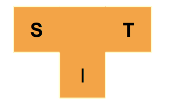
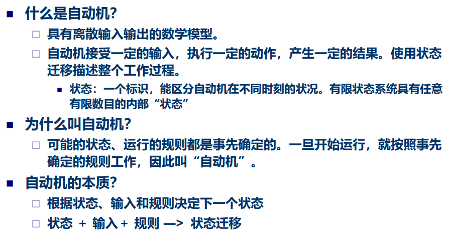
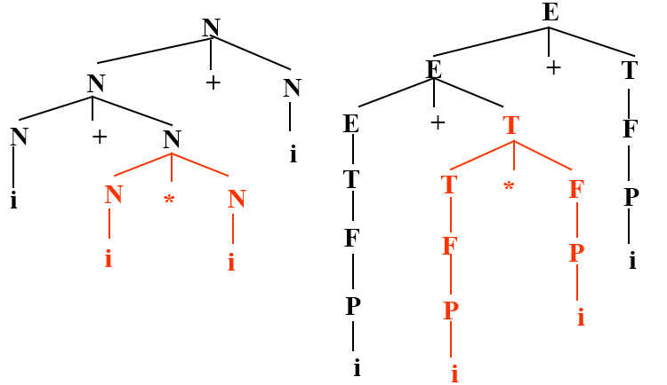
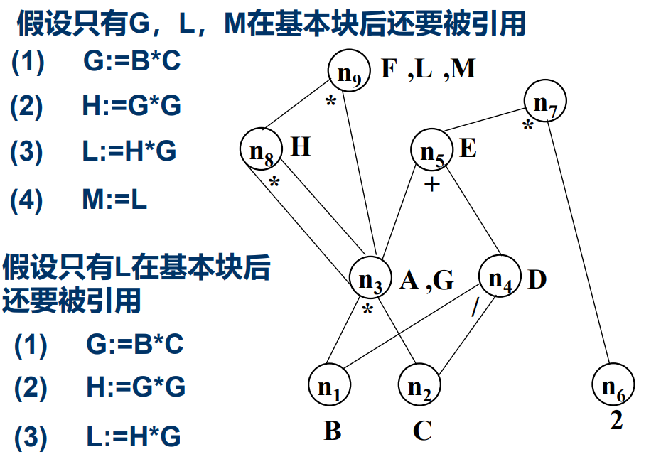

# 编译原理

[TOC]

> *为重点

---

## 1. 引论

> T形图

### 1.1 什么叫编译程序

* 程序语言发展：机器语言(数字代码)→汇编语言(符号)→高级语言(类似数学定义或自然语言)
* 程序执行方式：
  * 解释：**逐个**语句地分析和执行
    * 结果：源程序的**执行结果**
  * 编译：对**整个**程序进行分析，翻译成等价机器语言程序后执行
    * 结果：源程序的**目标代码**

### 1.2 编译过程概述

* 编译的五个基本阶段：
  1. 词法分析
  2. 语法分析
  3. 语义分析与中间代码生成
  4. 优化
  5. 目标代码生成
* **词法分析：**
  * 又称扫描程序
  * 任务：读源程序的字符流、识别单词，并转换成内部形式
    * 输入：源程序中的字符流
    * 输出：等长的内部形式，即属性字
  * 依循的是语言的**词法规则**
  * 描述词法规则的有效工具是**正规式**和**有限自动机**
  * 方法：状态图，DFA，NFA 
* **语法分析：**
  * 又称识别程序
  * 任务：读入由词法分析程序识别出的符号，根据给定语法规则， 识别出各个语法单位, 并生成另一种内部表示
    * 输入：由词法分析程序识别出并转换的符号
    * 输出：另一种内部表示，如语法分析树或其它中间表示
  * **语法规则**通常用上下文无关文法描述
  * 方法：递归子程序法、LR分析法、算符优先分析法
* **语义分析与中间代码生成：**
  * 静态语义检查，中间代码翻译
  * **语义分析：**
    * 主要任务： 进行类型审查，审查每个算符是否符合语言规范，不符合时应报告错误
      * 变量是否定义
      * 类型是否正确
  * **中间代码生成：**
    * 任务：将各类语法单位，翻译为中间代码序列
      * 输入：句子
      * 输出：中间代码序列
    * 中间代码的形式：常见的有四元式、三元式和逆波兰式等
    * 方法：语义子程序；DAG图(有向无环图)；语法制导翻译
* **优化：**
  * 任务：对前段产生的中间代码进行加工， 把它变换成功能相同，但功效更高的优化了的中间表示代码，以期在最后阶段产生更为高效的代码
  * 依循的原则是程序的**等价变换规则**
  * 方法：公共子表达式的提取、循环优化、删 除无用代码等等。
* **目标代码生成：**
  * 把中间代码变换成特定机器上的低级语言代码
  * 与机器相关

### 1.3 编译程序的结构

* 表格：
  * **符号名表**(最重要)：
    * 记录源程序中使用的名字
    * 收集每个名字的各种属性信息
      * 类型、作用域、分配存储信息
  * 常数表
  * 标号表
  * 入口名表
  * 过程引用表

* 出错处理：
  * 错误类型：
    * 语法错误：可在词法分析和语法分析阶段查出来
    * 语义错误：有些可在编译时查出来，有些则需在运行时才能查出来
  * 好的编译程序：
    * **全**：最大限度发现错误
    * **准**：准确指出错误的性质和发生地点
    * **局部化**：将错误的影响限制在尽可能小的范围内
    * 若能自动校正错误则更好，但其代价非常高
* 编译阶段的组合：
  * 划分仅仅是指其逻辑结构，具体实现时经常组合在一起
  * 前端：词法分析、语法分析、语义分析、 中间代码生成、优化工作
  * 后端：目标机有关的优化工作、目标代码生成等
* 遍：
  * 对源程序或源程序的中间结果**从头到尾扫描一次**，并做相关处理，生成新的中间结果或目标程序的过程
  * 处理数据的一个完整周期，在前一遍的中间结果的基础上
  * 次数和效果：
    * 多遍编译：少占内存，多耗时间
    * 一遍编译：多占内存，少耗时间

### 1.4 编译程序的生成

* 编译程序实现语言：
  * 机器语言
  * 汇编语言
    * 充分发挥各种不同硬件系统的效率
    * 满足各种不同的具体要求
  * 高级语言
    * 大大节省程序设计的时间
    * 构造出来的编译程序易于阅读、维护和移植
* T形图：
  * 
  * S：源语言
  * T：目标语言
  * I：实现语言
  * 
  * 移植：
    * 
    * 利用A机器上已有的高级语言L编写一个能在B机器上运行的高级语言L的编译程序
* 编译程序的生成技术：
  * 自编译：用某种高级语言书写自己的编译程序称为自编译
  * 交叉编译：用x机器上的编译程序产生可在y机器上运行的目标代码
  * 自动编译：自动生成编译程序的软件工具
    * 
* 编译程序在计算机系统中的地位：一种系统软件

---

## 2. 高级语言及其语法描述

* 题：
    > 文法$\iff$语言：P36 6
    >
    > 推导：P36 8
    >
    > 语法树
    >
    > 证明二义性：找出两种推导 P36 9

### 2.1 程序设计语言的定义

* 程序语言的内涵：
  * 语法：表示构成语言句子的各个单词符号之间的组合规律(构成规则)
  * 语义：表示按照各种表示方法所表示的各个单词符号的特定含义（各个单词符号和单词符号所表示的对象之间的关系）
  * 语用：表示各个单词符号或语言词句与其使用之间的关系
* 语法：语言的语法是指可以形成和产生程序的一组规则。它包括**词法规则**和**语法规则**
  * **词法规则**：程序中单词符号的形成规则。单词符号一般包括：标识符、基本字、常量、算符和界符
  * **语法规则**：程序中语法单位的形成规则。程序语言的语法单位有：表达式、语句、分程序、过程、函数、程序
  * 描述方式：自然语言、语法图、**BNF(巴科斯范式)范式**、或**文法**等
* 语义：定义它的单词符号和语法单位的意义，是一组用来定义一个程序的意义的规则
  * 方法：基于属性文法的语法制导翻译方法

---

* 程序语言的功能：
  * 描述**数据**和对数据的**运算**
  * 

### 2.2 高级语言的一般特性

* 高级语言的分类：
  * 强制式：过程式语言
  * 应用式：函数式语言
  * 基于规则：条件→动作
  * 面向对象：封装/继承/多态
* 程序结构：
  * 单层结构：主程序＋若干个辅程序段（子程序、函数）
  * 多层结构：程序允许嵌套定义
* 类型：
  * 初等数据类型
  * 复合数据类型：结构、数组
  * 抽象数据类型：类
    * 信息隐蔽
    * 数据封装
    * 优点：可读性、可靠性、可维护性
* 语句：
  * 按功能分：
    * 执行性语句
    * 说明性语句
  * 按形式分：
    * 简单句
    * 复合句
    * 分程序

### 2.3 程序语言的语法描述(*)

* 编译原理=形式语言理论+编译技术
* 形式语言：某个字母表上的字符串的集合，有一定的描述范围
* 文法：用来定义语言的一个数学模型，描述语言的语法结构的形式规则
* 表示语言的方法： 
  * 语言L是有限集合：列举法
  * L是无限集合：
    * **文法**产生系统，由定义的文法规则产生出语言的每个句子（**生成**）
    * 机器识别系统(**自动机**)：当一个字符串能被一个语言的识别系统接受， 则这个字符串是该语言的一个句子，否则不属于该语言（**识别**）

---

#### 文法

* **文法的形式定义：**

  * 
  * 终结符号、非终结符号、开始符号、产生式
  * 终结符号：组成语言字母表中的基本符号，属于个体记号
  * 非终结符号：需要进一步定义的符号
    * 用来代表语法范畴
    * 一个类 （或集合）记号
  * 开始符号：非终结符号，至少必须在某个产生式的左部出现一次
  * 产生式：
    * 左部符号：非终结符号
    * 右部符号：终结符号或与非终结符号组成的一符号串
    * 若干个左部相同的产生式如$P\rightarrow \alpha_1,P\rightarrow \alpha_2,P\rightarrow \alpha_3,\dots,P\rightarrow \alpha_n$ 可合并成一个，缩写为$P\rightarrow \alpha_1|\alpha_2|\dots|\alpha_n$，每个$\alpha_i$称为是$P$的一个候选式

* **文法的习惯写法：**

  

* **文法的简化表示：**

  * 只写出产生式部分
  * 约定第一个产生式的左部符号为初始符号 或 在产生式前写上“G[A]”，其中G为文法名，A为初始符号
  * 

* **从文法产生语言的句子：**

  * 基本思想：从识别符号开始，把当前产生的符号串中的**非终结符号**替换为相应产生式右部的**符号串**，直到最终全由**终结符号**组成。 这种替换过程称为**推导**或产生句子的过程， 每一步称为**直接推导**或直接产生

  * 直接推导：

    

  * 规约(推导的逆过程)：

    

  * 推导：

    * 
    * 若存在一个$\alpha_1$到$\alpha_n$的一个推导，则称$\alpha_1$可推导出$\alpha_n$
    * 
    * 

  * 最左(右)推导(规约)：

    * 若在推导关系中，每次最先替换最左（右） 的非终结符，则称为**最左（右）推导**
    * 若在归约过程中，每次最先归约最左（右） 的非终结符，则称为**最左（右）归约**
    * 

* **句型、句子和语言：**

  

  * 例子：
    * 文法$G1[S]:S\rightarrow bA,A\rightarrow aA|a$，语言：$L(G1)=\{ba^n|n\geq1\}$
    * 文法$G2[S]:S\rightarrow AB,A\rightarrow aA|a,B\rightarrow bB|b$，语言：$L(G2)=\{a^mb^n|m,n\geq1\}$
    * 语言$L(G3)=\{a^n b^n|n\geq1\}$，文法$G3[S]:S\rightarrow aSb|ab$或$\{\{S\},\{a,b\},\{S\},\{S\rightarrow aSb|ab\}\}$
    * 题：P36 6,8

---

#### Chomsky文法体系

* 0型文法：无限制文法，短语文法 

  * 对应的语言：递归可枚举语言
  * 与图灵机等价

  > 可长推短

* 1型文法：上下文有关文法

  * $P\rightarrow\alpha,|P|\leq|\alpha|$
  * 对应的语言：上下文有关语言
  * 若不考虑ε，与线性有界自动机(LBA)等价

  > 短推长

* 2型文法：上下文无关文法

  * $P\in V_N$
  * 对应的语言：上下文无关语言
  * 对应的自动机：下推自动机(PDA)

  > 左部为一个非终结符

* 3型文法：正规文法

  * 右线性文法：任何产生式为$A\rightarrow\omega B$或$A\rightarrow\omega$，其中$A,B\in V_N,\omega\in V_T^*$ 
  * 左线性文法：任何产生式为$A\rightarrow B\omega$或$A\rightarrow\omega$，其中$A,B\in V_N,\omega\in V_T^*$ 
  * 等价于正规式
  * 对应的语言：正规语言 
  * 对应的自动机：有限自动机

  > 右部的非终结符在最右边或最左边

* 总结：

  * 自然语言是上下文有关的
  * 上下文无关文法有足够的能力描述现今多数程序设计语言的语法结构
  * 基于**正规文法**讨论**词法分析**问题
  * 基于**上下文无关文法**讨论**语法分析**问题
  * 用**上下文无关文法**和**正规文法**描述语言**语法**，而其中上下文有关的问题，可通过表格处理解决

---

#### 语法分析树

* 语法树：表示一个**句型推导过程**的图，是一棵倒立的树

* 从推导构造语法树：

  * 把**开始符号**S做为语法树的**根结点**， 对每一个**直接推导**画一次**结点**的扩展，该结点是直接推导中被替换的**非终结符号**， 其所有儿子结点所组成的**符号串**是推导中所用**产生式右部**。直到推出**句型**或**句子**或无法再推导时结束

* 语法树的特征：

  

* 语法树解释：

  * 语法树表明了在推导过程中使用了哪条规则和使用在哪个非终结符号上，但它并没有表明**使用规则(产生式)的顺序**

* 

---

#### 二义性

* 如果一个文法的句子（句型）存在两棵语法树，那么该**句子是二义性的**

* 如果一个文法包含二义性的句子，则称这个**文法是二义性的**；否则，该文法是无二义性的

* 二义文法改造为无二义文法：规定优先级

* 证明二义性：找出一个句型的两种推导

* 规定：作为描述程序语言的上下文无关文法，对其如下限制：

  

* 题：P36 9

---

## 3. 词法分析(*)

* 编译程序首先是在单词级别上来分析和翻译源程序的
* 词法分析的任务是：从左至右逐个字符地对源程序进行扫描，产生一个个单词符号，把作为**字符串**的源程序改造成为**单词符号串**的中间程序
* 词法分析是编译的基础。执行词法分析的程序称为**词法分析器**
* **题(*)：**
  
    > 写出正规式 P64 8
    >
    > NFA转正规式：状态消去法
    >
    > 正规式转NFA(*)：Thompson算法
    >
    > 
    >
    > NFA转DFA(*)：子集法 P64 12
    >
    > DFA化简(*)：等价状态法，划分子集  P64 12
    >
    > 右线性文法转NFA
    >
    > DFA转右线性文法
    >
    > 右线性文法转左线性文法(*)：右线性文法→NFA(→DFA→化简)→左线性文法(括号中可选)  P65 15

---

### 3.1 对于词法分析器的要求

* 词法分析器的功能：输入**源程序**，输出**单词符号**
* 单词符号：
  * 关键字：由程序语言定义的具有固定意义的标识符，又称**保留字**或**基本字**
  * 标识符：用来表示各种名字，如变量名、数组名、过程名
  * 常数
  * 运算符
  * 界符：如逗号、分号、括号
* 词法分析器输出的单词符号常表示成二元式：(单词种别, 单词符号的属性值)
  * **单词种别**是语法分析需要的信息，通常用整数编码
    * 标识符：一种
    * 常数：按类型分种
    * 关键字：全体为一种或一字一种
    * 运算符：一符一种或具有一定共性的运算符视为一类
    * 界符：一符一种
  * **单词符号属性值**则是编译其它阶段需要的信息，简称单词值
    * 如果一个种别只含一个单词符号，那么种别编码就代表自身
    * 如果一个种别含多个单词符号，那么每个单词符号除了给出种别编码外还要给出**单词符号的属性信息**
    * 属性值：
      * 标识符：存放它符号表项的指针或内部字符串
      * 常数：存放它的常数表项的指针或二进制形式
      * 关键字、运算符和界符是一符一种，不需给出其自身的值
* 词法分析程序的实现方式：
  * 完全独立方式：作为单独一遍
    * 输出作为语法分析程序的输入
    * 编译程序结构简洁、清晰和条理化
  * 相对独立方式：作为语法分析程序的一个独立子程序
    * 语法分析程序需要新符号时调用这个子程序
    * 避免了中间文件生成，可以提高效率

---

### 3.2 词法分析器的设计

* 词法分析器结构：
  * 
  * 扫描缓冲区边界问题：
    * 一分为二，两个半区互补使用
    * 对标识符和常数的长度加以限制(不超过半区长度)
* 单词符号的识别：超前搜索
  * 标识符的识别：字母开头的“字母/数字”串，后面跟着算符或界符，不难识别
  * 常数的识别：某些语言需要超前搜索
  * 算符和界符的识别：复合成的算符，需要超前搜索

---

####  状态转换图(*)

* 大多数程序设计语言中单词符号的**词法规则**可以用**正规文法**描述，利用这些规则识别单词符号的过程可用**状态转换图**来表示，而状态转换图识别单词符号的过程又可以方便地用程序实现

* 转换图：一个**有限方向图**

  * 结点代表状态，用圆圈表示
    * **初态**：一张转换图的启动条件，通常有一个，用圆圈表示
    * **终态**：一张转换图的结束条件，至少有一个，用双圈表示
  * 状态之间用方向弧连接。弧上的标记（字符）代表在出射结点状态下可能出现的输入字符或字符类
  * 状态转换图中只包含有限个状态（结点）

* 状态转换图的作用：

  * 一个状态转换图可用于**接受**（或**识别**）一定的符号串
  * 路：在状态转换图中**从初始状态到某一终止状态**的弧上的**标记序列**
  * 存在一条路产生β，则称状态转换图接受（或识别）该符号串β，否则称符号串β不能被接受

* 状态转换图所能识别的语言：能被状态转换图TG接受的符号串的集合 L(TG)

  

* 状态转换图示例：

  

* 状态转换图识别单词符号的过程:

  1. 从初态开始
  2.  从输入串中读一个字符
  3.  判明读入字符与从当前状态出发的哪条弧上 的标记相匹配，便转到相应匹配的那条弧所指 向的状态
  4. 重复3，均不匹配时便告失败；到达终态时便识别出一个单词符号

---

### 3.3 正规表达式与有限自动机(*)

#### 正规式与正规集

* 定义：

  

* 三种运算示例：

  

* 运算符的优先顺序：`*`最高,，`.`次之,，`|` 最低

* 运算律：

  * 交换律
  * 结合律
  * 分配律
  * ε

* 例子：

  * 以01结尾的二进制数串：(0|1)*01
  * 能被5整除的十进制整数：(1|2|…|9) (0|1|2|…|9)*(0|5) |0|5
  * 包含奇数个0的二进制数串：1* 0(1|01* 0)*

---

#### 自动机

* 自动机：

  

* 有限自动机：

  * 定义：

    

  * 模型：

    

---

#### 确定有限自动机 (DFA)

* 定义：

  

* 表示方法：

  * 状态转换矩阵：用一个矩阵表示，该矩阵的行表示状态，列表示输入字符，矩阵元素表示δ(s,a)的值

    

  * 状态转换图：

    

* 扩展转移函数：连续输入多个字符

  * 

  * 例子：

    

* 被DFA接收的字符串：输入结束后使DFA的状态到达终止状态。否则该字符串不能被DFA接收

* DFA接受的语言：被DFA接收的字符串的集合

  * $L(M)=\{\alpha\ |\ \delta'(s_0,\alpha)\in F\}$

---

####  非确定有限自动机(NFA)

* NFA：修改DFA的模型,使之在某个状态, 对应一个输入,可以有多个转移, 到达不同的状态，即**具有在同一情况下可有不同选择的能力**

* 定义：

  

* 表示：

  

* NFA扩展转移函数：

  

* NFA和DFA的等价性：

  * DFA是NFA的特例，所以NFA必然能接收DFA能接收的语言
  * 一个NFA所能接收的语言能被另一个DFA所接收
  * 设一个NFA接受语言L，那么存在一个DFA接受L
    * 证明策略：对于任意一个NFA，构造一个接收它所能接收语言的 DFA，这个DFA的状态对应了NFA的状态集合
  
* **NFA转化为DFA(*)：**

  * 对NFA M的状态转换图进行改造，得到M'：

    

  * 将M'进一步变换为DFA：

    * 构造状态转换矩阵
    * 对状态子集重新命名得新状态转换矩阵
    * 画出新的 DFA

---

####  正规式与有限自动机的等价性(*)

* 正规式与有限自动机是等价的
  * 对任何FA M ，都存在一个正规式V，使得 L(V) = L(M)
  * 对任何正规式V，都存在一个FA M , 使得 L(M) = L(V)
* **从 NFA 构造等价的正规式：**
  * 
* 从正规式构造等价的NFA：Thompson算法
  * 
  * 

---

#### DFA的化简(*)

* 思路：将 DFA M 的状态集划分为不相交的子集, 使不同的两个子集的状态可区别，同一个子集的状态都等价
* 化简步骤：
  * 

---

#### 正规文法和有限自动机的等价性

* 对于正规文法G和有限自动机M，如果 L(G)=L(M)，则称G和M是等价的

* 正规文法与有限自动机的等价性：

  * 对每一个右（左）线性正规文法G，都存在一个有限自动机M，使得L(G)=L(M)
  * 对每一个有限自动机M，都存在一个右（左）线性正规文法G ，使得L(G)=L(M)

* **右线性正规文法生成NFA：**

  * 

  * 例：

    

* 求与右线性文法等价的左线性文法：右线性文法→NFA→DFA→左线性文法

* **DFA产生右线性正规文法：**

  * 

  * 从初态开始，找出边，到终态的出边为终结符

  * 例：

    

* DFA产生左线性文法：

  * 产生右线性文法反过来，从终态开始，找入边，从初态过来的入边为终结符

  

---

## 4. 语法分析——自上而下分析

* 题：

  > 消除左递归
  >
  > 计算终结首符集FIRST(先消除左递归)
  >
  > 计算后继符号集FOLLOW
  >
  > 预测分析法：LL(1)分析表的构造

---

### 4.1 语法分析器的功能

* 语法分析的任务：

  * 对任一给定 $w\in V_T^*$，判断$w\in L(G)?$

* 语法分析器在编译程序中的地位：

  

* 语法分析方法：

  * 自上(顶)而下分析(推导)：从文法的开始符号出发，反复使用各种产生式，寻找与输入符号匹配的最左推导
    * LL(1)分析法
    * 实现LL(1)的两种方法：
      * 递归下降分析法
      * 预测分析法
  * 自下(底)而上分析(规约)：从输入符号串开始，逐步进行归约(最右推导的逆过程)，直至归约到文法的开 始符号
    * 算符优先分析法
    * LR分析法

---

### 4.2 自上而下分析方法概述

* 自上而下分析：
  * 从文法的开始符号出发，向下推导，推出句子
  * 对任何的输入串(单词符号)，试图用一切可能的办法, 从文法的开始符号出发，自上而下地为输入串建立一棵语法树，即为输入串寻找一个最左推导
* 带回溯自上而下分析面临的问题：
  * 文法的**左递归**问题
  * **虚假匹配**问题
  * **回溯**
  * 实际上采用了一种**穷尽一切可能的试探法**，因此效率很低， 代价很高

---

### 4.3 LL(1)分析方法(*)

* LL(1)分析方法：从左(**L**eft)到右扫描输入串；构造最左(**L**eftmost) 推导；分析时每步向前看一个**(1)**字符
* 目的：构造不带回溯的自上而下分析算法
  * 左递归的消除
  * 消除回溯，提左因子
  * FIRST集合，FOLLOW集合
  * LL(1)分析条件
  * LL(1)分析方法

---

#### 左递归文法

* 左递归文法：
  * 直接递归：$A\rightarrow \beta,A\in V_N,\beta\in V^*$
  * 间接递归：
    * $A\rightarrow B\beta$
    * $B\rightarrow A\alpha\quad A,B\in V_N,\ \alpha,\beta\in V^*$

> 如果一个 文法是左递归时，则不能采用自顶向下分析法。

* 消除直接左递归(类比左线性转右线性)：

  * 左递归文法：$P\rightarrow P\alpha|\beta$

  * 改写：

    * $P\rightarrow \beta P'$
    * $P'\rightarrow\alpha P'|\varepsilon$

  * 例：

    

  * 一般情况：

    

* **消除左递归(*)：**

  * 

  * 例：

    

---

#### 回溯问题

* 无回溯：

  * 对任非终结符A，用它匹配输入串时能够根据当前输入，准确地指派一个候选式
    * 若匹配成功，则不虚假
    * 若匹配不成功，则其它的候选式也不会成功
  * 即当A执行匹配时，$A\rightarrow\alpha_1│\alpha_2│\dots │\alpha_n$ 若A面临的第一个输入符号为a，则应该准确地指派某一个$\alpha_i$，其成败完全代表A，无需进行试探和回溯

* 文法的要求：

  * 不含左递归

  * 对每个非终结符的候选式，其任何推导的头符号（终结符）集合两两不相交

  * 终结首符集：

    

* **计算终结首符集(*)：**

  

  * 例：

    

* 计算符号串的FIRST集：

  * 
  
  * 例：
  
    
  
* 回溯解决方法：

  * 提取公共左因子，将文法改造成任何非终结符的所有候选首符集两两不相交
  * 

---

#### LL(1)分析条件

* 后继终结符号集FOLLOW：

  * 

  * 构造：

    

  * 例：

    

---

#### LL(1)文法

---

#### LL(1)分析方法

---

### 4.4 递归下降分析程序

---

### 4.5 预测分析程序(*)

* 递归下降分析器的局限性：需要具有能够实现递归过程的语言和编译系统

* 预测分析程序：

  * 使用一个分析表和符号栈进行联合控制，是实现LL(1)分析的另一种有效方法

* 基本思想：

  * 根据输入串的当前输入符确定选用某一个产生式进行推导，当该输入符与推导的第一个符号相同时，再取输入串的下一个符号，继续确定下一个推导应选的产生式，如此下去，直到推出被分析 的输入串为止

* 预测分析程序分析器组成：

  * LL(1)分析表（预测分析表）
  * 符号栈（后进先出）
  * 控制程序（表驱动程序）

* 程序：

  

* 分析表构造：

  

* 分析表与LL（1）文法：

  

---

## 5. 语法分析——自下而上分析(*)

题：

> 短语、直接短语、句柄
>
> 规范规约：句柄
>
> FIRSTVT、LASTVT
>
> 优先关系表
>
> LR(0)项目集规范族构造，DFA
>
> 构造SLR(1)分析表
>
> 二义文法：书P123-P126

---

### 5.1 自下而上分析基本问题

#### 归约

* 移进-归约法：使用一个符号栈，把输入符号逐一移进栈，当**栈顶形成某个产生式右部**时，则将栈顶的这一 部分替换（**归约**）为该**产生式的左部符号**

* 自下而上分析的基本问题：
  * 如何找出或确定可规约串
  * 对找出的可规约串替换为哪一个非终结符号

---

### 5.2 规范规约(*)

* 短语：

  * 

  * 短语：句型语法树中**每棵子树**（某个结点连同它的所有子孙组成的树）的**所有叶子结点从左到右排列起来**形成一个相对于子树根的短语

  * 直接短语：只有**父子两代的子树**形成的短语

  * 句柄：语法树中**最左**那棵**只有父子两代**的子树形成的短语

  * 例：

    

    > 二义性文法的句柄可能不唯一

* 规范规约：

  * 

    > 写出语法树

* 语法分析的操作

  * 移进：下一输入符号移进栈顶,读头后移；
  * 归约：检查栈顶若干个符号能否进行归约，若能，就以产生式左部替代该符号串，同时输出产生式编号；
  * 接收：移进－归约的结局是栈内只剩下栈底符号和文法开始符号，读头也指向语句的结束符； 
  * 出错：发现了一个语法错，调用出错处理程序

---

### 5.3 算符优先分析方法 

* 算符优先分析方法：

  * 算符优先分析法是自下而上进行句型归约的一种分析方法
  * 定义**终结符**（算符）的优先关系，按终结符 （算符）的优先关系控制自下而上语法分析过程（寻找“**可归约串**”和进行归约）
  * 不是规范归约，但分析速度快，适于表达式的语法分析

* 优先关系：任何两个可能**相继出现**的终结符a和b（它 们之间可能插有一个非终结符）的**优先关系**

* 算符文法：一个文法，如果它的任一产生式右部都**不含两个相继**（并列）的**非终结符**，则称该文法为**算符文法**

* 算符优先关系：

  * 

* **算符优先文法**：任何终结符对(a, b)**至多**满足三个优先关系之一的算符文法

  * 例：

    

* FIRSTVT(P)和LASTVT(P)：

  

* 优先关系表的构造：

  

* FIRSTVT(P)和LASTVT(P)构造：

  * 

  * 算法：

    

* 构造优先关系表算法：

  * 

* 最左素短语：算符优先分析中的可归约串

  * 素短语：是一个短语，它至少含有一个终结符且除它自身之外不含有任何更小的素短语
  * 最左素短语：处于句型最左边的那个素短语
  * 

* 算符优先文法的最左素短语：

  

* 算法优先算法：

  

* 算符优先与规范规约：

  

---

### 5.4 LR分析方法(*)

#### LR分析法

* 算符优先分析算法只适用于算符优先文法，还有很大一类上下文无关 文法可以用LR分析法分析

* LR分析法中的**L**表示从左向右扫描输入串， **R**表示构造最右推导的逆。LR分析法是严格的**规范规约**

* LR分析法原理：在移进 - 归约过程中寻找句柄

  * 历史: 在分析栈中已移进和归约的符号串
  * 展望: 根据当前使用的产生式推测未来可能遇到的输入符号
  * 现实: 当前输入符号

* **分析表：**

  * ACTION[s, a]：当状态s面临输入符号a时，应采取什么动作
  * GOTO[s, X]：状态s面对文法符号X时，下一状态是什么
    * GOTO[s, X]定义了一个以文法符号为字母表的DFA

* LR分析法：

  * 总控程序: 所有的LR分析器相同
  * 分析表: 是自动生成语法分析器的关键
    * LR (0) 表：基础、有局限性
    * SLR表：简单LR表，实用
    * 规范LR表：能力强、代价大
    * LALR表：向前LR表，介于SLR和规范LR之间

* Action[s,a]：

  

* LR文法：

  

#### LR(0)(*)

* LR(0)项目：文法G 的产生式右部加一个圆点( ·)，称为G的一个**LR(0) 项目**。它指明了在分析过程的某时刻**看到**产生式的多大部分

* 活前缀：规范句型的一个前缀，前缀的尾符号最多包含到句型的句柄，即这种前缀不含句柄之后的任何符号

* 在LR分析工作过程的任何时候，栈里的文法符号（自栈 底向上）应该构成活前缀

* 对于一个文法G，可以构造一个识别G的所有活前缀有限自动机，并以此构造LR分析表

* LR(0)构造状态：

  * 方法一：**识别活前缀的NFA方法**

    * 构造识别文法所有活前缀的NFA：

    

    * 项目1为NFA的唯一初态，任何状态（项目）均认为是NFA的终态

    * NFA转DFA：

      

  * 方法二：LR(0)项目集规范族

    * 构成识别一个文法活前缀的DFA的项目集（状态） 的全体称为文法的**LR(0)项目集规范族**

      * $A\rightarrow\alpha\cdot$称为"归约项目"
      *  归约项目$S'\rightarrow\alpha\cdot$称为"接受项目"
      * $A\rightarrow\alpha\cdot a\beta(a\in V_T)$称为"移进项目"
      * $A\rightarrow\alpha\cdot B\beta(B\in V_N)$称为"待约项目"

    * 拓广文法：文法G是一个以S为开始符号，构造它的拓广文法G'

      * 包含整个G
      * 引进了一个不出现在G中的非终结符S'（ G'的开始符号）
      * 增加一个新产生式$S'\rightarrow S$

    * 项目集I的闭包CLOSURE(I)：

      

    * 状态转换函数GO(I，X)：

      

    * LR(0)项目集规范族构造算法：

      

* LR(0)文法：G的拓广文法G'不存在下述情况

  * 既含移进项目又含归约项目

  * 含有多个归约项目

    > 即：LR(0)文法规范族的每个项目集不包含任何冲突项目

* 分析表的ACTION和GOTO子表构造方法：

  

#### SLR(*)

* LR(0)文法太简单，没有实用价值
* SLR(1)解决办法：

* 构造SLR(1)分析表方法：

  

* SLR(1) 文法：按上述方法构造出的ACTION与GOTO表，不含多重入口

* 每个SLR(1)文法都是无二义的。但也存在许多无二义文法不是SLR(1)的

#### LR(1)

* **SLR存在的问题：**计算FOLLOW集合所得到的超前/后继符号集合可能大于实际能出现的超前/后继符号集

* 规范LR分析表的构造：

  

  

#### LALR

略

#### 二义文法(*)

* 二义文法的特点：
  * 二义文法决不是LR文法
  * 简洁、自然
  * 可以用文法以外的信息来消除二义
  * 语法分析的效率高（基于消除二义后得到的分析表）

> 冲突通过优先级解决

---

## 6. 属性文法和语法制导翻译

题：
> 标注语法树：P164 1
>
> 写出属性文法：P164 5
---

### 6.1 属性文法

#### S-属性文法

* 在语法树中，一个结点的**综合属性**的值由其**子结点**的属性值确定

* 使用自底向上的方法在每一个结点处使用语义规则计算综合属性的值

* 仅仅使用综合属性的属性文法称**S-属性文法**

* 例：

  

#### L-属性文法

* 继承属性：在语法树中，一个结点的**继承属性**由此结点的**父结点和/或兄弟结点**的某些属性确定

* L-属性文法：

  

* 例：

  

---

### 6.2 语法制导翻译

* **语法制导翻译法**：由源程序的语法结构所驱动的处理办法

* **一遍扫描**：一遍扫描的处理方法是在语法分析的同时计算属性值

  * **S-属性文法**适合于一遍扫描的自下而上分析
  * **L-属性**文法适合于一遍扫描的自上而下分析

* 写出属性文法：

  * P164 5：

    

---

## 7. 语义分析和中间代码产生(*)

题：

> 表达式→后缀式
>
> 写出抽象语法树/DAG
>
> 赋值语句的翻译：语法树、三地址代码
>
> 条件控制布尔式翻译：四元式
>
> 控制语句的翻译：if，while

---

### 7.1 中间语言 

* 常用的中间语言：
  * 后缀式
    * 逆波兰表示
  * 图表示：
    * DAG
    * 抽象语法树
  * 三地址代码：
    * 三元式
    * 四元式
    * 间接三元式

#### 后缀式

* 定义：

  * 变量或常量：自身
  * $E_1\ op\ E_2$：$E_1'\ E_2'\ op$，$E_1'\ E_2'$为$E_1\ E_2$的后缀式
  * $(E_1)$：$E_1$的后缀式

* 计算：

  * 用一个栈实现
  * 一般的计算过程是：自左至右扫描后缀式，每碰到运算量就把它推进栈。每碰到k目运算符就把它作用于栈顶的k个项，并用运算结果代替这k个项

* 表达式翻译成后缀式：

  

#### 图表示法

* **抽象语法树**：在语法树中去掉那些对翻译不必要的信息，从而获得更有效的源程序中间表示
  * 操作符和关键字都不作为叶子结点，而作为内部节点
  * 
* **DAG**：抽象语法树合并公共子表达式
  * $a+a*(b-c)+(b-c)*d$:
  * 

#### 三地址代码(*)

* 三地址代码：x:=y op z

  * 可以看成是抽象语法树或DAG的一种线性表示
  * 

* 三地址语句种类：

  

* 四元式：一个带有四个域的记录结构，这四个域分别称为op, arg1, arg2 及result

  

* 三元式：

  * 通过计算临时变量值的语句的位置来引用这个临时变量

  * 三个域：op、arg1和arg2

    

* 间接三元式：三元式表+间接码表

  * 间接码表:一张指示器表，按运算的先后次序列出有关三元式在三元式表中的位置

* 比较：

  * 三元式中使用了指向三元式的指针，优化时修改较难
  * 间接三元式优化只需要更改间接码表，并节省三元式表存储空间
  * 修改四元式表也较容易，只是临时变量要 填入符号表，占据一定存储空间

---

### 7.2 说明语句

略

---

### 7.3 赋值语句的翻译(*)

* 简单算术表达式及赋值语句的翻译模式：

  * 属性id.name 表示id所代表的名字本身

  * 过程lookup(id.name)检查是否在符号表中存在相 应此名字的入口。如果有，则返回一个指向该表项 的指针，否则，返回nil表示没有找到

  * 过程emit将生成的三地址语句发送到输出文件中

  * 

    > emit才产生代码，只有:=，+，*，- 这四条产生式

* 例：$A:=B*(-C+D)$

  

---

### 7.4 布尔表达式的翻译

#### 布尔表达式的翻译

* 布尔表达式：用布尔运算符把布尔量、关系表达式联结起来的式子

  * 布尔运算符：and, or, not
  * 关系运算符：＜,≤,＝, ≠，＞ ,≥
  * 运算符优先级：布尔运算由高到低：not and or，同级左结合；关系运算符同级，且高于布尔运算符

* 计算布尔表达式通常采用两种方法：

  * 一步步算
  * 采用优化措施(短路计算)

* 对应两种翻译方法：

  * 数值表示法：

    * 

    * 翻译模式：

      * $a<b\ or\ c<d\ and\ e<f$：

      

#### 作为条件控制的布尔式翻译(*)

* 两遍扫描：

  * 为给定的输入串构造一棵语法树
  * 对语法树进行深度优先遍历，进行语义规则中 规定的翻译

* 一遍扫描：

  * 

  * 回填：有时，四元式转移地址无法立即知道，我们只好把这个未完成的四元式地址作为E的语义值保存，待 机"回填"

  * 为非终结符E赋予两个综合属性E.truelist和 E.falselist。它们分别记录布尔表达式E所应的四元式中需回填“真”、“假”出口的四元式的标号所构成的链表

  * 变量和过程：

    

  * 布尔表达式的文法：

    

* 例：

  * 
  * 

---

### 7.5 控制语句的翻译

#### if 语句的翻译(*)

* 改写：

  

* 翻译模式：

  

#### while 语句的翻译(*)

* 改写：

  

* 翻译模式：

  

* 例：

  

#### 语句L→L;S的翻译

---

### 7.6 过程调用的处理

* $CALL\quad S(A，X+Y)$：
  * 计算X+Y，置于T中
  * param A
  * param T
  * call S

---

## 8. 优化(*)

题：

>划分基本块
>
>DAG优化基本块：P306 3
>
>循环优化：做出程序流图，优化 P307 5

---

### 8.1 概述

* 优化：对程序进行各种**等价变换**，使得从变换后的程序出发，能生成更有效的目标代码
* 原则：
  * **等价**原则：经过优化后不应改变程序运行的结果
  * **有效**原则：使优化后所产生的目标代码运行时间较短，占用的存储空间较小
  * **合算**原则：应尽可能以较低的代价取得较好的优化效果
* 优化的三个不同级别：
  * 局部优化
  * 循环优化
  * 全局优化
* 优化的种类：
  * 删除多余运算 (或称删除公用子表达式 ) 
  * 复写传播
  * 删除无用赋值
  * 代码外提
  * 强度削弱
  * 变换循环控制条件
  * 合并已知量

* 删除公共子表达式：

* 复写传播：

* 删除无用赋值：

* 强度削弱：循环中的控制变量乘法变加法
* 删除归纳变量：
  * B2中的i与T2的值保持着线性关系 
  * B3中的j与T4的值保持着线性关系
  * 此种变量称之为归纳变量
  * 对该类变量也可进行优化

---

### 8.2 局部优化(*)

#### 基本块

* 基本块：**顺序执行**语句序列，只有**一个入口**(第一个语句)和**一个出口**(最后一个语句)
* 如果一条三地址语句为x:=y+z，则称对x**定值**并**引用y**和z
* 在一个基本块中的一个名字，所谓在程序中的某个给定点是**活跃**的，是指如果在程序中(包括在本基本块或在其它基本块中)它的值在该点以后被引用
* 局部优化：局限于基本块范围内的优化称为**基本块内的优化**
  * 删除公共子表达式
  * 删除无用赋值
  * 合并已知量
  * 临时变量改名
  * 交换语句的位置
  * 代数变换

#### 划分基本块

* 划分四元式程序为基本块的算法：

  * 求基本块的入口语句：
    * 程序第一个语句
    * 能由条件转移语句或无条件转移语句转移到 的语句
    * 紧跟在条件转移语句后面的语句
  * 确定基本块：
    * 该入口语句到下一入口语句
    * 到一转移语句
    * 到一停语句
  * 删除未被纳入某一基本块中的语句

* 例：

  

  

#### 优化措施

* 合并已知量：$T_1 :=2 \dots T_2 :=4*T_1$ 变换成 $T_2 :=8$
* 临时变量改名：$T:=b+c$ 其中T是一个临时变量名。改成： $S:=b+c$
* 交换语句的位置：
  * $T_1 :=b+c $
  * $T_2 :=x+y$
* 代数变换：
  * 删除 x:=x+0 或 x:=x*1
  * $x:=y**2 $(调用函数完成) 变换成 $x:=y*y$

#### 流图

* **结点**：基本块
* **首结点**：入口语句是程序的第一条语句
* 如果在某个执行顺序中，基本块B2紧接在基本块B1之后执行，则从B1到B2有一条有向边
  * B1是B2的**前驱**，B2是B1的**后继**

#### 基本块的DAG表示(*)

* 基本块的DAG：

  * **叶结点**：以一**标识符**或**常数**作为标记，表示该结点代表该变量或常数的值
  * **内部结点**：以一**运算符**作为标记，表示该结点代表应用该运算符对其后继结点所代表的值进行运算的结果
  * **附加一个或多个标识符**表示这些变量具有该结点所代表的值。
  * 与各四元式相对应的DAG结点形式：
    * 
    * 
    * 
    * 

* 构建DAG算法步骤：

  * 准备操作数的结点
  * 合并已知量
  * 寻找公共子表达式
  * 删除无用赋值

* 例：

  

  

---

### 8.3 循环优化

#### 代码外提

* 循环不变运算：

  

* 代码外提条件：

  * 不变运算所在的结点是L所有出口结点的必经结点
  * 出循环后不再引用I的值，即使不在必经结点内也可以考虑外移
  * A在循环中其他地方未再定值，才能把循环不变运算A:=B op C外提
  * S(A:=B OP C)外提条件：循环中所有A的引用点只有S中的A的定值才能到达

* 查找循环L的不变运算的算法：

  * 

#### 强度削弱

* 把程序中执行时间较长的运算转换为执行时间较短的运算：
  * 乘法运算用递归加法运算替换
* 强度削弱主要是针对与基本归纳变量**有线性关系**的**归纳变量**的赋值运算进行
* 经过强度削弱后，循环中可能出现一些新的无用赋值
* 对于削弱下标变量地址计算的强度非常有效。

#### 删除归纳变量

---

## 9. 目标代码生成(*)

题：

> 待用/活跃信息表
>
> 目标代码：P327 1

---

### 9.1 基本问题

* 代码生成：把语法分析后或优化后的**中间代码**变换成**目标代码**
* 考虑的问题：
  * 减少目标代码
  * 充分利用寄存器，减少目标代码访存次数
  * 充分利用指令系统的特点
* 代码生成器的**输入**：
  * 中间代码
  * 符号表中的信息
    * 利用符号表信息决定数据对象运行时地址
    * 类型检查
* 代码生成器的**输出**：
  * 能够立即执行的机器语言代码
  * 待装配的机器语言模块
  * 汇编语言代码
* 方法考虑：
  * 指令选择
    * 一致性和完整性
    * 指令速度
  * 寄存器分配
  * 计算顺序选择

---

### 9.2 目标机器模型

* 抽象的计算机模型：

  * 多个通用寄存器，可以作为累加器或变址器
  * 运算必须在某个寄存器中进行
  * 含有四种类型的指令形式

* 指令：

  

---

### 9.3 一个简单的代码生成器

* 在一个**基本块**的范围内考虑如何充分利用寄存器：

  * **尽可能留**：在生成计算某变量值的目标代码时，尽可能让该变量保留在寄存器中
  * **尽可能用**：后续的目标代码尽可能引用变量在寄存器中的值，而不访问内存
  * **及时腾空**：在离开基本块时，把存在寄存器中的现行的值放到主存中

* **待用信息**：在一个基本块内，四元式i对A定值，四元式j引用A值，i到j之间没有A的其他定值，则j是四元式i的变量A的待用信息

* **活跃信息**：该变量在基本块出口之后是不是活跃的

* 待用信息和活跃信息的表示：

  

* 计算待用信息和活跃信息的算法步骤：

  * 开始时，把基本块中各变量的符号表登记项中的待用信息栏填为“**非待用**” ，并根据该变量在基本块出口之后是不是活跃的，把其中的**活跃信息**栏填为“活跃” 或“非活跃”
  * 
  * 

* 寄存器描述和地址描述：

  

* **代码生成算法**：四元式: i: A:=B op C

  * 调用寄存器分配算法返回一个寄存器R，用来存放A
  * 利用AVALUE确定B和C当前存放的寄存器B'和C'
    * B和C都不在R中，则生成：$LD\ R,B',op\ R,C'$
    * B在R中，生成$op\ R,C'$，删除AVALUE[B]中的R
    * C在R中，生成$op\ R,B'$，删除AVALUE[C]中的R
  * A在R中：AVALUE[A]={R}, RVALUE[R]={A}
  * 若B或C不再被引用，删除其占用的寄存器

* **寄存器分配算法**：

  * 原则：
    * 尽可能用B独占的寄存器
    * 尽可能用空闲寄存器
    * 抢占用非空闲寄存器
  * 若B独占$R_i$
    * B与A是同一个标识符 或者 B之后不再引用
    * 返回$R_i$
  * 若有空闲寄存器，选择一个返回
  * 无空闲寄存器，选取一个$R_i$返回
    * 占用$R_i$的变量的值在内存 或着 在很远的将来才被用到
  * 生成存数指令：

* 例：

  

---

