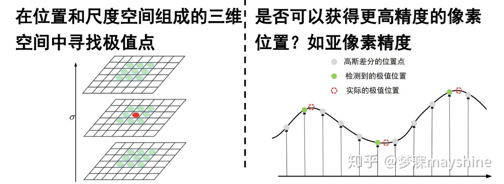
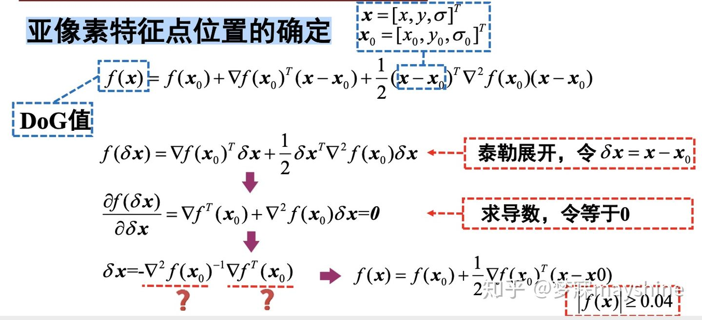
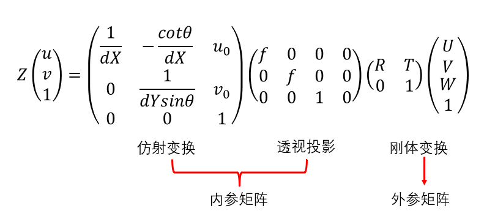

## 第二章&第三章 图像匹配相关

> 课件上的公式推导，课件中的问题

### 1. 基础知识

* 线性几何变换：
  * D：自由度
  * 1D rotation：$x'=Rx$，$R$ is ortho(正交)，$det(R)=1$，$R\in SO(2)$
    * 旋转
  * 3D isometry（保距变换）：$x'=Tx=[\begin{matrix}R&t\\0&1\end{matrix}]x$，$R\in SO(2),t\in R^2,T\in SE(2)$
    * 旋转+平移
  * 4D similarity（相似变换）：$x'=[\begin{matrix}sR&t\\0&1\end{matrix}]x$ ，similarity ratio（相似比不变）
    * 旋转+缩放+平移
  * 6D affine（仿射变换）：$x'=[\begin{matrix}A_{2\times2}&t\\0&1\end{matrix}]x$，$A$ is nonsigular，simpl ratio（简单比不变）
    * 线性变换+平移
    * https://www.zhihu.com/question/20666664?sort=created
  * 8D projective（射影变换）： $cx'=[\begin{matrix}a_{11}&a_{12}&a_{13}\\a_{21}&a_{22}&a_{23}\\ a_{31}&a_{32}&a_{33}\end{matrix}]x$ ，对每个点$c$不同，用于抵消整体变换产生的缩放，cross ratio（交比不变）
  * 所有射影变换矩阵构成群，封闭性、结合律、有幺元、有逆元；该群只有一种代数运算，即矩阵乘法；是李群(Lie Group)，连续变换群，矩阵间过渡是光滑连续的，可微
* 
* 全景拼接：

  * 检测关键点
  * 建立点之间的关系，建立描述组(线性方程组)
  * 利用最小二乘法解出变换矩阵
  * 利用变换矩阵对图像进行变换

---

### 2. Harris角点检测

* 角点检测（Harris Corner Detector）：

  * 角点：往任何方向移动窗口都会引起比较大的灰度变换

  * 

  * $\begin{equation}
    \begin{aligned}
    &S_{w}(\Delta x, \Delta y)=\sum_{\left(x_{i}, y_{i}\right) \in w}\left(f\left(x_{i}, y_{i}\right)-f\left(x_{i}+\Delta x, y_{i}+\Delta y\right)\right)^{2}\\
    &\approx \sum_{\left(x_{i}, y_{i}\right) \in w}\left(f\left(x_{i}, y_{i}\right)-f\left(x_{i}, y_{i}\right)-\left[\frac{\partial f\left(x_{i}, y_{i}\right)}{\partial x}, \frac{\partial f\left(x_{i}, y_{i}\right)}{\partial y}\right]\left[\begin{array}{l}
    \Delta x \\
    \Delta y
    \end{array}\right]\right)^{2}\\
    &=\sum_{\left(x_{i}, y_{i}\right) \in w}\left(\left[\frac{\partial f\left(x_{i}, y_{i}\right)}{\partial x}, \frac{\partial f\left(x_{i}, y_{i}\right)}{\partial y}\right]\left[\begin{array}{l}
    \Delta x \\
    \Delta y
    \end{array}\right]\right)^{2}\\
    &=[\Delta x, \Delta y]\left[\sum_{\left(x_{i}, y_{i}\right) \in w}\left[\frac{\frac{\partial f\left(x_{i}, y_{i}\right)}{\partial x}}{\frac{\partial f\left(x_{i}, y_{i}\right)}{\partial y}}\right]\left[\frac{\partial f\left(x_{i}, y_{i}\right)}{\partial x} \frac{\partial f\left(x_{i}, y_{i}\right)}{\partial y}\right]\right)\left[\begin{array}{c}
    \Delta x \\
    \Delta y
    \end{array}\right]\\
    &=\left[\begin{array}{ll}
    \Delta x & \Delta y
    \end{array}\right] M\left[\begin{array}{l}
    \Delta x \\
    \Delta y
    \end{array}\right]
    \end{aligned}
    \end{equation}$ 

    > $f(x+\Delta x,y+\Delta y)=f(x,y)+\Delta xf_x(x,y)+\Delta y f_y(x,y)+\dots$ 
    >
    > $A^2=A^T A$, $(AB)^2=(AB)^T(AB)=B^TA^TAB$  
  * 

  * 步骤：

  * 计算图像x,y方向的偏导数$I_x,I_y$
    
    * 计算每个像素点的偏导数平方$I_x^2,I_y^2,I_xI_y$ 
  * 计算梯度在每个像素点的和（每个像素点权重不一样，通过高斯滤波实现）
    * $S_{x2}=G_{\sigma}*I_{x2},S_{y2}=G_{\sigma}*I_{y2},S_{xy}=G_{\sigma}*I_{xy}$ 
    * 计算$M$ 
    * 计算每个像素的角点响应$R=Det(M)-k(Trace(M))^2$
    * 设置阈值找出可能点并进行非极大值抑制
      * 非极大值抑制：一个像素点是角点，周围的点则不是角点，因此选一个响应值最大的点

  * 特点：

  * 旋转不变性：椭圆旋转后形状不变，$R$值不受旋转影响
    
    * 无尺度不变性：窗口没有自适应性，没有提供自动选择窗口大小的方法

* 寻找对应点（局部图像描述子）：

  * 按行/列展开成向量，flatten
  * 计算相关系数（归一化的互相关矩阵）
  * 特点：
    * 无旋转不变性
    * 无尺度不变性

---

### 3. 尺度不变角点检测

* 尺度空间理论

* 自动尺度选择：
  * 穷举搜索：固定一张图的窗口大小，改变另一张图的窗口大小
  * 缺点：效率低
  
* 思路：
  * 寻找尺度不变点
  * 知道其特征尺度
  
* 方法
  * 设计一个特征尺度函数，根据直方图计算，单峰曲线，尺度不变性
  * 函数为窗口大小的函数
  
* LOG算子：

  * $Laplace(f)=\frac{\partial^2f}{\partial x^2}+\frac{\partial^2f}{\partial y^2}$ 

    * Laplace算子是梯度的散度：$\Delta f=\nabla\cdot \nabla f$
      * $\Delta \overset{\Delta}{=} \nabla^2 \overset{\Delta}{=} \nabla \cdot \nabla = (\frac{\partial}{\partial x}\overset{\rightarrow}{i} + \frac{\partial}{\partial y}\overset{\rightarrow}{j})\cdot (\frac{\partial}{\partial x}\overset{\rightarrow}{i} + \frac{\partial}{\partial y}\overset{\rightarrow}{j}) = \frac{\partial^2}{\partial x^2}+\frac{\partial^2}{\partial y^2}$ 

  * $LoG$算子：Gaussian Blur+Laplace

    * $G(x,y;\sigma)=\frac{1}{2\pi \sigma^2} exp(-\frac{x^2+y^2}{2\sigma^2})$

    * $\frac{d}{dt^2}[h(t)*f(t)]=\frac{d}{dt}\int f(\tau)h(t-\tau)d\tau \\ = \int f(\tau)\frac{d}{dt^2}h(t-\tau)d\tau=f(t)*\frac{d}{dt^2}h(t)$ 

    * $LoG=\Delta G= \nabla^2G = \frac{\partial^2G}{\partial x^2}+\frac{\partial^2G}{\partial y^2}$ 

      * $\frac{\partial^2 G}{\partial x^2}=\frac{x^2-\sigma^2}{\sigma^4}G$
      * $\frac{\partial^2 G}{\partial y^2}=\frac{y^2-\sigma^2}{\sigma^4}G$ 
      * $LoG=\frac{x^2+y^2-2\sigma^2}{2\pi \sigma^6}exp(-\frac{x^2+y^2}{2\sigma^2})$ 

      

  > $\nabla$：梯度      $\Delta$：Laplace算子

* 拉普拉斯高斯（Laplacian-of-Gaussian，LoG）：
  * https://zhuanlan.zhihu.com/p/128937547
  * 散度：标量
  * 特征尺度：拉普拉斯响应值最大的尺度
    * Why：参考文献
  * 高斯函数形状和极值点形状相似，响应值大
  * 步骤：
    * 计算每个像素点的特征尺度及其响应值
    * 非极大值抑制
    * 得到特征点的位置和特征尺度
  * 
  * 输出：$(x,y,\sigma)$

* SIFT：
  * 已有角点和特征尺度，如何做一个描述符
  * 如何建立点对关系（ppt没有）
  * 详解：
    * https://blog.csdn.net/zddblog/article/details/7521424
    * https://zhuanlan.zhihu.com/p/128937547
  * 步骤：
    * **构造尺度空间**
      * 尺度空间使用高斯金字塔表示
        * 对图像做不同尺度的高斯模糊
        * 对图像做降采样
      * 使用高斯金字塔每组中相邻上下两层图像相减，得到高斯差分图像
    * **空间极值点检测**
      * 每个像素点和它同尺度的8个相邻点和上下尺度对应的$9\times2$个点共26个点比较
    * **关键点定位(子像素插值)**
      * 离散空间的极值点并不是真正的极值点
      * 为了提高关键点的稳定性，需要对尺度空间DoG函数进行曲线拟合
      * 
      * 
    * **消除边缘响应**
      * 
      * https://zhuanlan.zhihu.com/p/366778678
    * **方向确定**
      * 计算统计梯度直方图
      * 以直方图中最大值作为该关键点的主方向
      * 将坐标轴旋转为关键点的方向
    * **建立描述子**
      * 在每子区域内计算8个方向的梯度方向直方图
      * 形成4x4x8=128维的SIFT特征向量
      * 怎么建立描述子：128+1+1+2
        * 128维梯度方向
        * 1维尺度
        * 1维主方向
        * 2维位置
      * **步骤：**
        * 对关键点周围的像素采样
        * 按主方向旋转坐标
        * 分成4x4的区分
        * 在每子区域内计算8个方向的梯度方向直方图
    * **建立点对关系**

---

### 4. 单应性估计(Homography Estimation)

* 矩阵求导术：

  * 
  * 
  * 本质：https://zhuanlan.zhihu.com/p/263777564
  * 公式推导：
    * https://zhuanlan.zhihu.com/p/273729929
    * https://zhuanlan.zhihu.com/p/288541909

* 函数极值：

  * 雅可比矩阵：一阶偏导数组成的矩阵
    * $\left[ \begin{matrix} \frac{\partial f_1}{\partial x_1}&\cdots & \frac{\partial f_1}{\partial x_n} \\ \vdots & \ddots & \vdots  \\  \frac{\partial f_m}{\partial x_1}&\cdots & \frac{\partial f_m}{\partial x_n} \end{matrix} \right]$
  * 海森矩阵：二阶偏导数组成的矩阵
    * $\left[ \begin{matrix} \frac{\partial^2 f}{\partial^2 x_1}&\cdots & \frac{\partial^2 f}{\partial x_1\partial x_n} \\ \vdots & \ddots & \vdots  \\  \frac{\partial^2 f}{\partial x_n \partial x_1}&\cdots & \frac{\partial^2 f}{\partial^2 x_n} \end{matrix} \right]$
  * 一元函数极值点：
    * 必要条件：一阶导数为零
    * 充分条件：二阶导数大于或小于零
    * $f'(x)=0,f''(x)>0/<0$
    * $f(x_0+h)=f(x_0)+f'(x_0)h+\frac{1}{2}f''(x_0)h^2+o(h^2)$
  * 多元函数极值点
    * 必要条件：一阶偏导数为零
    * 充分条件：
      * $f(x_0+h)=f(x_0)+h^T\Delta f(x_0)+\frac{1}{2}h^T\Delta^2f(x_0)h+o(||h||^2)$
      * $h^T\Delta^2f(x_0)h>0/<0$海森矩阵为正定矩阵

* 拉格朗日乘子法：

  * 有约束条件下，找驻点

* 最小二乘法：

  >  记住矩阵求导常用公式

  * https://zhuanlan.zhihu.com/p/30809762
  * 作用：方程个数大于未知数个数时，求解线性方程组
  * 非齐次线性方程组：$Ax=b$
    * $E(x)=|Ax-b|^2$极值点
      * $\frac{dE(x)}{dx}=0$
      * $E=(Ax-b)^T(Ax-b)=(x^TA^T-b^T)(Ax-b)=x^TA^TAx-x^TA^Tb-b^TAx+b^Tb$
      * $\frac{dE}{dx}=2A^TAx-2A^Tb=0$
      * $A^TAx=A^Tb$
      * $x=(A^TA)^{-1}A^Tb$
    * 证明$A^TA$可逆
  * 齐次线性方程组：$Ax=0$
    * $Ax=0,rank(A)=q,$非零解个数为$q-q=0$，无平凡解
    * $E$无法取到零，但是可以求其在约束条件下的最小值
    * 求$||x||_2=1$下$||Ax||_2^2$的最小值
    * 结论：$E(x)=\lambda$最小，即$A^TA$的最小特征值对应的特征向量

  > $||x||_2$：2-范数    $||x||_2=(\sum^{n}_{i=1}x_i^2)^{\frac{1}{2}}$  

* 单应性(Homography)矩阵：

  * 单应矩阵推导：https://zhuanlan.zhihu.com/p/74597564
  * 点由齐次坐标表示，单应性矩阵与尺度无关，因此单应性矩阵有8个自由度
  * 每个点对确定两组方程，即每个点对能确定两个自由度
  * 因此确定一个单应性矩阵需要4个点对

* RANSAC（随机抽样一致）：

  * 流程：
    * 随机取s个数据拟合一个模型(对于直线拟合来说就是两个点，对于计算Homography矩阵就是4个点)
    * 使用该模型来预测所有数据，计算“内点”数量（在一定误差范围内的数据）
    * 如果“内点”数量大于一个阈值T，则认为模型足够好，用所有“内点”拟合一个新的模型
    * 重复以上步骤，迭代一定次数后，用最大的“内点“数拟合一个模型，作为一个新模型

---

## 第四章 单目相机相关

### 1. 射影几何

* 中科院计算机视觉射影几何讲义：<a href="http://vision.ia.ac.cn/zh/teaching/附录1-射影几何简介.pdf">射影几何简介</a>
* 齐次坐标：
  * 平面上：
    * 点：$(x,y)^T$
    * 直线方程：$ax+by+c=0$
  * 齐次坐标：
    * 直线方程乘以t：$axt+byt+ct=0 \Rightarrow (a,b,c)(xt,yt,t)^T = 0$ 
    *  点：$\mathbf{x}=(xt,yt,t)^T$   
    * 直线：$\mathbf{l}=(a,b,c)^T$
    * $\mathbf{l}^T \mathbf{x}=0$  
* 无穷远点：$\mathbf{x_{\infty }}=(x,y,0)^T$ 
* 无穷远线：$\mathbf{l_{\infty}}=(0,0,1)^T$
  * 两个无穷远点的叉积 
  * $0\cdot x+0\cdot y+1\cdot 0=0 $ 
* 射影平面(二维射影空间)：由欧氏平面与无穷远直线的并集所形成的扩展平面
* 点与线：
  * 若三点$x_1,x_2,x_3$ 共线，则必有$det(x_1,x_2,x_3)=(x_1\times x_2)^T x_3=0$ 
    * $\begin{equation}
      \boldsymbol{x}_{1} \times \boldsymbol{x}_{2}=\operatorname{det}\left(\begin{array}{lll}
      \boldsymbol{i} & \boldsymbol{j} & \boldsymbol{k} \\
      x_{1} & y_{1} & t_{1} \\
      x_{2} & y_{2} & t_{2}
      \end{array}\right)=\left(\operatorname{det}\left(\begin{array}{ll}
      y_{1} & t_{1} \\
      y_{2} & t_{2}
      \end{array}\right),-\operatorname{det}\left(\begin{array}{ll}
      x_{1} & t_{1} \\
      x_{2} & t_{2}
      \end{array}\right), \operatorname{det}\left(\begin{array}{ll}
      x_{1} & y_{1} \\
      x_{2} & y_{2}
      \end{array}\right)\right)^{T}
      \end{equation}$ 
    * $\begin{equation}
      \boldsymbol{l}^{T} \boldsymbol{x}_{j}=\left(\boldsymbol{x}_{1} \times \boldsymbol{x}_{2}\right)^{T} \boldsymbol{x}_{j}=\operatorname{det}\left(\boldsymbol{x}_{1}, \boldsymbol{x}_{2}, \boldsymbol{x}_{j}\right)=0, j=1,2
      \end{equation}$ 
    * $l=x_1\times x_2$表示通过这两个点的直线 
  * 两点$x_1,x_2$的连线是$l=x_1\times x_2$ 
  * 三点$x_1,x_2,x_3$共线的充要条件是$det(x_1,x_2,x_3)=0$ (一个点在另外两个点组成的直线上)
  * **对偶原理：**在射影平面内，点和线是一对互为对偶元素。在包含“点”与 “线”元素的命题中，如果将元素的角色互换，则对应的命题也成立，并称它们为一对对偶命题
* 射影变换： 
  * $x'=Hx\Rightarrow \begin{equation}
    \left(\begin{array}{l}
    x_{1}^{\prime} \\
    x_{2}^{\prime} \\
    x_{3}^{\prime}
    \end{array}\right)=\left(\begin{array}{lll}
    h_{11} & h_{12} & h_{13} \\
    h_{21} & h_{22} & h_{23} \\
    h_{31} & h_{32} & h_{33}
    \end{array}\right)\left(\begin{array}{l}
    x_{1} \\
    x_{2} \\
    x_{3}
    \end{array}\right)
    \end{equation}$
  * 射影变换将平面上的点变换到点，并且保持点的共线性质，即将平面上的直线变为直线
  * 任何射影变换的逆变换(对应于单应矩阵的逆)都是射影变换、任意两个的合成(对应于两个单应矩阵的积)都是射影变换，因此射影变换的全体构成射影平面上的一个变换群
* 直线的无穷远点：
  * 直线与无穷远线的交点

---

### 2. 摄像机成像几何

---

### 3. 单目相机

* 摄像机标定：
  * 建立摄像机成像的几何模型，求解摄像机参数
  * 参数作用：消除镜头畸变，测量物体，判断相机位置
  
* 相机成像模型：小孔成像

* 摄像机参数：
  * 内在因素
  - 失真系数
  - 外在因素
  
* 摄像机成像过程：

  * 世界坐标系→相机坐标系→成像平面坐标系→像素坐标系（像素化）
  * 坐标系：

    - 世界坐标系(3D)：毫米为单位
    - 相机坐标系(3D)：毫米为单位
    - 成像平面坐标系(2D)：毫米为单位
    - 像素坐标系(2D)：像素为单位
  * 变换：

    * 世界坐标系→相机坐标系：刚体变换
    * 像素化：$d_x$毫米为单位，$c_x$像素为单位
  * $\begin{equation}
    \mathbf{u}=\frac{1}{Z_{C}} \cdot \mathbf{K}_{3 \times 3}[\mathbf{R} \quad \mathbf{t}]_{3 \times 4} \mathbf{P}_{4 \times 1}
    \end{equation}$ （世界坐标$\Rightarrow$像素坐标）
  * 成像模型：
    * 
    * $$\begin{equation}
      \left[\begin{array}{l}
      u \\
      v \\
      1
      \end{array}\right]=\left[\begin{array}{lll}
      f_{x} & 0 & c_{x} \\
      0 & f_{y} & c_{y} \\
      0 & 0 & 1
      \end{array}\right] \cdot \mathcal{D}\left\{\frac{1}{Z_{C}}\left[\begin{array}{ll}
      \mathbf{R} & \mathbf{t}
      \end{array}\right]_{3 \times 4}\left[\begin{array}{l}
      X_{w} \\
      Y_{w} \\
      Z_{w} \\
      1
      \end{array}\right]\right\}
      \end{equation}$$  

* **相机内参：**

  * $f_x,f_y,C_x,C_y$ 
  * 相机畸变：https://zhuanlan.zhihu.com/p/137880472
    * 径向畸变：由凸透镜本身形状引起的
      * $k_1,k_2,k_3$
    * 切向畸变：由于制造上的缺陷使透镜不与成像平面平行而产生的
      * $\rho_1,\rho_2$ 
  * 鱼眼相机：FOV非常大（大于100°），使用另一个相机畸变模型
    * $k_1,k_2,k_3,k_4$ 

* **相机外参：**$\mathbf{R},\mathbf{t}$ 

* **相机标定：**求解内外参数

  * 每个点确定2组方程，$n$个点确定$n$组方程
  * **张正友标定法：**https://zhuanlan.zhihu.com/p/94244568
    * 需要标定板：横坐标偶数，纵坐标奇数，保证坐标系唯一确定
    * 多张图像
    * 角点检测
    * 像素空间坐标和世界空间坐标的点对组成方程组
      * 对于不同的图片，内参矩阵为定值
      * 对于同一张图片，内参矩阵和外参矩阵为定值
      * 对于同一张图片上的不同点，内参矩阵、外参矩阵和尺度因子$Z$为定值
  * **问题定义：**
    * $\begin{equation}
      \Theta^{*}=\underset{\Theta}{\arg \min } \sum_{i=1}^{M} \sum_{j=1}^{N} \frac{1}{2}\left\|\mathbf{K} \cdot \mathcal{D}\left\{\frac{1}{Z_{C i j}}\left[\mathbf{R}_{i} \mathbf{t}_{i}\right] \mathbf{P}_{j}\right\}-\mathbf{u}_{i j}\right\|_{2}^{2}
      \end{equation}$ 
    * 相机参数：$\begin{equation}
      \Theta=\left\{f_{x}, f_{y}, c_{x}, c_{y}, k_{1}, k_{2}, \rho_{1}, \rho_{2}, k_{3},\left\{\mathbf{R}_{i}\right\}_{i=1}^{M},\left\{\mathbf{t}_{i}\right\}_{i=1}^{M}\right\}
      \end{equation}$
    * $\mathbf{P}_j$：第$j$个角点的世界坐标
    * $\mathbf{u}_{ij}$：第$j$个角点在第$i$张图像上的像素坐标
    * 内参矩阵：$\mathbf{K}=\left[ \begin{matrix} f_x & 0 & c_x \\ 0 & f_y & c_y \\ 0 & 0 & 1 \end{matrix} \right]$ 
    * 对$M$张图像，每张图像有$N$个角点，能得到$2\times M\times N$个方程，要求$9+6M$个未知参数
  * **步骤：**
    1. 求解内参矩阵与外参矩阵的积
    2. 求解内参矩阵
    3. 求解外参矩阵
  * 相机标定程序流程：
    * 角点检测
    * 相机标定：内外参标定
    * 计算定标误差
    * 保存定标结果
  * 问题：
    * 初始值的选择

---

### 4. 三维空间旋转

* 四元数与三维旋转：https://krasjet.github.io/quaternion/quaternion.pdf
  * 欧拉角旋转：导致Gimbal Lock(万向节死锁)，三个自由度丢失一个自由度
  * 轴角式旋转：三个自由度，旋转轴$x,y,z$坐标和旋转角$\theta$ 
    * 旋转轴模长为1，给定两个坐标就能求第三个坐标
    * $\begin{equation}
      \mathbf{v}^{\prime}=\cos (\theta) \mathbf{v}+(1-\cos (\theta))(\mathbf{u} \cdot \mathbf{v}) \mathbf{u}+\sin (\theta)(\mathbf{u} \times \mathbf{v})
      \end{equation}$ 
  * 四元数：用四元数表示轴角式旋转
    * $v=[0,\mathbf{v}],q=[cos(\frac{1}{2}\theta),sin(\frac{1}{2}\theta)\mathbf{u}]$ 
    * $v'=qvq^*=qvq^{-1}=[0,\cos (\theta) \mathbf{v}+(1-\cos (\theta))(\mathbf{u} \cdot \mathbf{v}) \mathbf{u}+\sin (\theta)(\mathbf{u} \times \mathbf{v})]$ 
* 旋转相关知乎专栏：https://zhuanlan.zhihu.com/p/66157419
* 轴角式旋转(Axis-angle)：$\mathbf{d}=\mathbf{n}\theta$ 
  * $\mathbf{d}$： 
    * $\theta$：模代表旋转角度
    * $\mathbf{n}$：归一化向量代表旋转轴，右手坐标系
* 罗德里格(Rodrigues)旋转公式：
  * $\begin{equation}
    \mathbf{v}^{\prime}=\cos (\theta) \mathbf{v}+(1-\cos (\theta))(\mathbf{u} \cdot \mathbf{v}) \mathbf{u}+\sin (\theta)(\mathbf{u} \times \mathbf{v})
    \end{equation}$ 
  * 推导：https://zhuanlan.zhihu.com/p/85862903
    * 将要旋转的向量$\mathbf{v}$分解为平行和垂直于旋转轴$\mathbf{u}$的向量，分别旋转
    * $\mathbf{v}=\mathbf{v_{\parallel}}+\mathbf{v_{\perp}}$
      * $\mathbf{v_{\parallel}}=(\mathbf{u}\cdot \mathbf{v})\mathbf{u}$
      * $\mathbf{v_{\perp}}= \mathbf{v}-\mathbf{v_{\parallel}} =\mathbf{v}-(\mathbf{u}\cdot \mathbf{v})\mathbf{u}$  
    * $\mathbf{v'}=\mathbf{v'_{\parallel}}+\mathbf{v'_{\perp}} \\ =\mathbf{v_{\parallel}}+cos(\theta)\mathbf{v_{\perp}}+sin(\theta)( \mathbf{u}\times \mathbf{v_{\perp}}) \\ = \cos (\theta) \mathbf{v}+(1-\cos (\theta))(\mathbf{u} \cdot \mathbf{v}) \mathbf{u}+\sin (\theta)(\mathbf{u} \times \mathbf{v})$ 
    * 矩阵形式：https://zhuanlan.zhihu.com/p/31775921
      * $\mathbf{u}=(u_1,u_2,u_3)^T,\mathbf{v}=(v_1,v_2,v_3)^T$ 
      * $u$的投影矩阵：$\frac{\mathbf{u}\mathbf{u}^T}{\mathbf{u}^T\mathbf{u}}=\mathbf{u}\mathbf{u}^T(|\mathbf{u}|=1)$ 
      * 叉乘矩阵：
        * https://www.cnblogs.com/monoSLAM/p/5349497.html
        * $a\times b=\left| \begin{matrix} i & j & k \\ a_1 & a_2 & a_3 \\ b_1 & b_2 & b_3 \end{matrix} \right| \\ = (a_2b_3-a_3b_2)i+(a_3b_1-a_1b_3)j+(a_1b_2-a_2b_1)k \\ = \left[ \begin{matrix} a_2b_3-a_3b_2 \\ a_3b_1-a_1b_3 \\ a_1b_2-a_2b_1 \end{matrix} \right] \\ = \left[ \begin{matrix} 0 & -a_3 & a_2 \\ a_3 & 0 & -a_1 \\ -a_2 & a_1 & 0 \end{matrix} \right] \left[ \begin{matrix} b_1 \\ b_2 \\ b_3 \end{matrix} \right]$ 
        * $\mathbf{u}^{\land} = \left[ \begin{matrix} 0 & -u_3 & u_2 \\ u_3 & 0 & -u_1 \\ -u_2 & u_1 & 0 \end{matrix} \right] $ 
      * $\mathbf{v'}=R\mathbf{v}$  
      * $R=cos\theta I+(1-cos\theta)\mathbf{u}\mathbf{u^T}+sin\theta \mathbf{u}^{\land}$    
      *  
* 已知旋转矩阵$R$，求旋转角度$\theta$：
  * $R=cos\theta I+(1-cos\theta)\mathbf{u}\mathbf{u^T}+sin\theta \mathbf{u}^{\land}$两边取矩阵的迹 
  * $tr(R)=cos\theta\ tr(I)+(1-cos\theta)\ tr(\mathbf{u}\mathbf{u^T})+sin\theta \ tr(\mathbf{u}^{\land})$ 
  * $tr(I)=3$ 
  * $tr(\mathbf{u}^{\land})=0$ 
  * $tr(\mathbf{u}\mathbf{u^T})=|\mathbf{u}|^2=1$    
  * $\therefore tr(R)=1+2cos\theta \Rightarrow \theta=arccos(\frac{1}{2}[tr(R)-1])$     
* 已知旋转矩阵$R$，求旋转轴$\mathbf{n}$： 
  * https://zhuanlan.zhihu.com/p/86223712
  * $R\mathbf{n}=\mathbf{n}$ ，$\mathbf{n}$是$R$特征值为1的一个特征向量
  * 为什么$R$一定有特征值1？：
    * $R$为正交矩阵：$R^T=R^{-1}$ 
    * $R$行列式为1
    * $R$为$3\times$3矩阵
    * 证明：
      * n阶多项式有n个根，矩阵有n个特征值
      * 复数根的共轭复数也为根
      * 实矩阵的复数根成对出现
      * 正交矩阵特征值的模为1，实特征值只能为1或-1
      * 奇数阶特征矩阵，行列式为1，必有特征值1
        * 1，1，1
        * 1，-1，-1
        * 1，$c$，$\overline{c}$ 
  * 特征向量不为零向量！
  * 特征值对应的多个特征向量组成特征子空间，线性组合也为特征向量
* 正交矩阵实特征值为1或-1证明：https://www.zhihu.com/question/426320029

---

### 5. 非线性最小二乘法

> 考试重点！

* 极值点：
  * 海森矩阵为半正定矩阵或半负定矩阵
    * 凸函数：半正定矩阵
    * 凹函数：半负定矩阵
  * 海森矩阵为正定矩阵$\Rightarrow$严格凸函数
  * 严格凸函数的海森矩阵不一定是正定矩阵
* **必考：**
  * 求驻点：
    * 几种下降方法
    * 几种最小二乘法
  * 证明海森矩阵正定性：
    * Gauss-Newton Method(P43)
    * Levenberg-Marquardt Method(P46)
  * 给定$f$，计算$J$
* 下降(最优化)方法：
  * 梯度下降法
  * 牛顿法Newton
  * 置信区间Trust region
  * 阻尼法Dump
* 非线性最小二乘法：
  * 高斯-牛顿法(Gauss-Newton)：
    * 证明：$J$为列满秩矩阵$\Rightarrow$ $J^TJ$为正定矩阵(P43)
  * Levenberg-Marquardt
  *  Powell's Dog Leg
* 摄像机标定：
  * 目标函数
  * 如何对参数矩阵求导

