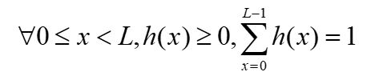
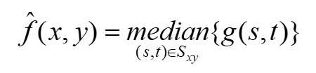

# 数字图像处理

[TOC]

## 1. 绪论

### 1.1 什么是数字图像

* **数字图像**是二维图像作为一组有限数量的数字值的表示，这些数字值称为图像元素或**像素**

* 像素值通常表示灰度级、颜色、高度、透明度等等

* 数字化意味着数字图像是真实场景的近似值

* 常见数字图像格式有：

  * 每个点一个取样（黑白图像或灰度图）
  * 每个点三个取样（红、绿、蓝）
  * 每个点四个取样（红、绿、蓝和透明度）
  * 本门课中涉及到的数字图像大部分为灰度图

* 一幅图像可定义为一个二维函数$f(x,y):R^2\rightarrow R$ 

  * $x$和$y$是空间坐标，$f(x,y)$称为图像在该点处的强度或灰度
  * 图像定义在一个矩形内，函数值范围有限：
    * $f:[a,b]\times[c,d]\rightarrow [0,255]$

* 彩色图像只是三个函数组合在一起，我们可以把它写成“向量值”函数：

  

* Matlab代码：

  

* 图像通常是离散值，用一个整数值矩阵表示

### 1.2 什么是数字图像处理

* 数字图像处理的两个主要应用领域：
  * 改善图示信息以便于人们解释
  * 为了方便存储、传输和表示而对图像数据进行处理，以便于机器自动理解
* 图像处理具体止步于哪些领域或者其他相关领域（比如图像分析或者是计算机视觉）从哪里开始，并没有一致的看法
* 从图像处理到计算机视觉的这个连续体能够被分成三种典型的计算处理：低级、中级和高级处理
  * 低级处理涉及一些基本操作，比如图像降噪，对比度增强，图像锐化等
    * 输入：图像
    * 输出：图像
  * 中级处理涉及的范围比较广，如图像分割、目标识别
    * 输入：图像
    * 输出：从这些图像中提取到不同特征，比如图像的轮廓信息，各个物体的标识
  * 高级图像处理涉及到“理解”图像上的内容，形成一些认知功能，如场景理解、自动驾驶
    * 输入：图像特征
    * 输出：认知

### 1.3 数字图像处理的应用

* 应用领域：
  * 医学
  * 天文
  * 生物
  * 气象学
  * 农业
  * 工业检验
  * 执法
  * 智能车辆

* 医学：X-ray，OCT，Ultrasound(超声波)，MRI(核磁共振成像)，CT(计算机断层)
  * CT：检测器环围绕着一个物体，并且一个与该环同心的X射线源绕着物体旋转，**X射线**穿过物体并由环中对面的检测器进行收集。重复该过程，通过感知的的数据来重建通过物体的“切片”图像；当物体沿垂直与检测器环的方向运动时，就产生了一系列这样的“切片”，这些切片组成该物体内部的三维再现
* 成像：
  * 电磁波频谱：
    * 
    * 
  * 伽马射线成像：
    * 主要用于核医学和天文检测
    * 在核医学中，将**放射性同位素**注射到人体内，当其**衰变**时就会放射出伽马射线，用**伽马射线检测仪**收集到的放射线来产生图像
      * 同位素是同一元素的不同原子，其原子具有相同数目的质子，但中子数目却不同
  * X射线成像：
    * 用于医学诊断，工业和其他领域
    * 物体被放在X射线源和对X射线能量敏感的胶片之间，X射线的强度受射线穿过病人时的吸收量调制，最终能量落在胶片上并使胶片感光
    * 血管照相术是对比度增强辐射成像领域中的另一个主要应用，得到的图像称为血管造影照片
    * CT、电路板缺陷检测
  * 紫外线成像：
    * 应用于平板印刷术、工业检测、显微镜方法、激光、生物成像、天文观测
    * 用于荧光显微镜中
  * 可见光及红外波段成像：
    * 红外波段常用于与可见光相结合成像
    * 应用于光显微镜方法、天文学、遥感、工业、法律实施
    * 遥感通常包括可见光和红外波谱范围的一些波段，多光谱成像能够区分不同环境
    * 多光谱掌纹识别
  * 微波波段成像：
    * 典型应用是雷达，雷达拥有在任何范围和任何时间内，不考虑气候、周围光照条件的收集数据的能力，某些雷达可以穿透云层，在一定条件下还可以穿透植被、冰层和极干燥的沙漠
  * 无线电波段成像：
    * 主要用于医学和天文学，在医学中用于核磁共振成像
  * 其他成像：
    * 声波成像，电子显微镜，计算机方法
    * 声波：地质勘探

## 2. 数字图像处理基础

### 2.1 视觉感知基本要素

* 人眼结构：

  

* 有三层薄膜包围着眼睛：角膜(cornea)与巩膜外壳(sclera)、脉络膜(choroid)和视网膜(retina)

  * 脉络膜外壳着色很重，因此有助于减少进入眼内的外来光和眼球内反向散射光的数量
  * 脉络膜的最前面分为睫状体(ciliary body)和虹膜(iris)，虹膜的收缩和扩张控制着进入眼睛的光量，虹膜中间的开口为瞳孔

* 眼睛最里面的膜是视网膜，当眼睛适当地聚焦时，来自眼睛外部物体的光在视网膜上成像

  * 视网膜上有两类光感受器：锥状体(cones)和杆状体(rods)

  * 锥状体主要位于视网膜的中间部分，称之为中央凹(fovea)，且对颜色高度敏感，通过锥状体人可以充分地分辨图像细节，锥状体视觉称为白昼视觉或亮视觉

  * 杆状体数量更多，分布在视网膜表面，杆状体用来给出视野内的一般的总体图像，它们没有彩色感觉，而对低照明度敏感，杆状体视觉称为暗视觉或微光视觉

  * 周围出现视神经的区域，没有感受器而导致所谓的盲点(blind spot)

  * 人类通常有三种视锥细胞，它们具有不同的光视蛋白(photopsins)，它们具有不同的光谱响应曲线，因此我们有三色视觉；有些人有四种或四种以上的视锥，使他们具有四色视觉

  * 视网膜感光细胞分布：

    

* 人眼成像：

  * 照相机中镜头有固定的焦距，各种距离的聚焦是通过改变镜头和成像平面间的距离实现的

  * 人眼中，晶状体和视网膜之间的距离是固定的，实现正确聚焦的焦距是通过改变**晶状体**的形状来实现的，睫状体中的纤维可实现这一功能，在远离或接近目标物时纤维会分别变扁或加厚晶状体

  * 图像聚焦在**视网膜**上，使视杆和视锥细胞兴奋，把辐射能转变为电脉冲，最终向大脑发送信号

  * 人眼和照相机对比：

    

* 感知亮度不是简单的强度的函数：

  * **马赫带**：视觉系统往往会在不同强度区域的边界处出现“下冲”或“上冲”现象
  * **同时对比**：感知区域的亮度并不简单地取决于其强度，而与周围的区域有关

* 视觉错觉：眼睛填充了不存在的信息或者错误地感知了物体的几何特点

### 2.2 光和电磁波谱

* 我们感受到的可见光的彩色范围只占电磁波的一小部分

* 人感受一个物体的颜色由物体反射光的性质决定

  * 除了频率之外，有三个基本量用于描述彩色光源的质量：发光强度(Radiance)、光通量(Luminance)和亮度(Brightness)
    * 发光强度：从光源流出能量的总量，通常用瓦特(W)来度量
    * 光通量：观察者从光源感受到的能量，用流明数(lm)度量
    * 亮度：光感知的主观描绘子，实际上不能度量

* 可见光波段：$0.43\mu m$(紫色)~$0.79\mu m$(红色)

  

### 2.3 图像感知和获取

* 图像是由**照射源**和形成图像的**场景**元素对光能的**反射**或**吸收**而产生的

* 传感器：

  * 单个传感器

    

  * 条带传感器：

    * 线传感器
    * 环形传感器带

  * 传感器阵列

### 2.4 图像取样和量化

* 把一幅连续图像转换为数字形式，对坐标值进行数字化称为**取样**，对幅值数字化称为**量化**

* 空间分辨率：图像中可辨别的最小细节的度量

  * DPI：每英寸点数
  * 空间分辨率的度量必须针对空间单位来规定才有意义，需要规定图像包含的空间维数；尺寸本身只是在图像容量间做比较时才有帮助

* 灰度分辨率：在灰度级中可分辨的最小变化

  * BPP：每像素比特数

  * 通常是2的整数次幂，最通用的数是8比特

    

* 图像内插：在放大、收缩、旋转和几何校正等任务中广泛应用的基本工具

  * 常用的方法有最近邻内插法(nearest neighbor)、双线性内插法(bilinear)、双三次内插法(bicubic)

### 2.5 像素间的一些基本关系

* 4领域、对角相邻元素、8领域：

  

## 3. 灰度变换与空间滤波

### 3.1 图像增强

* 图像增强是对一幅图像进行某种操作，使其结果在特定应用中比原始图像更适合进行处理
* 主要目的：
  * 突出图像中感兴趣的细节
  * 去除图像中的噪声
  * 使图像更具视觉吸引力
* 空间滤波和频域滤波：
  * 空间滤波直接以图像中的像素操作为基础
  * 频域滤波首先把一幅图像变换到变换域，在变换域中进行处理，然后通过反变换把处理结果返回到空间域

### 3.2 一些基本的灰度变换函数

* 空间域处理可表示为：$g(x,y)=T[f(x,y)]$

  * $f(x,y)$是输入图像，$g(x,y)$是处理后的图像，$T$是在点$f(x,y)$的邻域上定义的关于$f$的一种算子
  * 最小的领域大小为$1\times 1$，在这种情况下，$g$仅取决于点$(x,y)$处的$f$值，$T$则成为一个灰度变换函数$s=T(r)$，$r$和$s$分别表示$g$和$f$在任意点$(x,y)$处的灰度

* 图像反转：图像灰度级范围为[0,L-1]

  * $s=L-1-r$
  * 用于增强嵌入在一幅图像的暗区域中的白色或灰色细节

* 阙值变换：用于将感兴趣的物体从背景中分割出来：

  

* 对数变换：用于扩展图像中暗像素的值，同时压缩更高灰度级的值

  * $s=c\ log(1+r)$
  * 显示傅里叶频谱中的低值

* 幂律(伽马)变换：将较窄范围的暗色输入值映射为较宽范围的输出值

  * $s=cr^{\gamma}$

    

  * 对比度增强

* 对比度拉伸函数：$s=\frac{1}{1+(m/r)^{E}}$ 

  

* 分段线性变换函数：

  * 优点是分段线性函数的形式可以是任意复杂的，缺点是它的技术说明要求用户输入

  * 对比度拉伸：扩展图像灰度级动态范围的处理

    

  * 灰度级分层：使感兴趣范围的灰度变亮/变暗

    

  * 比特平面分层：高阶比特平面包含了在视觉上很重要的大多数数据，低阶比特平面在图像中贡献了更精细的灰度细节

    * 将图像分解为比特平面有助于分析图像中每个比特的相对重要性，这一处理有助于确定用于量化该图像的比特数是否足够；对图像压缩也很有用

### 3.3 直方图处理

* 概率论基础：

  * 概率密度函数PDF：

    

  * 累积分布函数CDF：

    

  * 均匀分布：

    

  * 高斯分布：

    

  * 期望：

    * 
    * 

  * 方差和标准差：

    * 
    * 
    * 

  * 高斯分布：

  * 协方差和相关系数：

    * 
    * 

* 直方图：

  * $h(x)$：图像中灰度值为$x$的元素个数

  * 计算直方图：

    

  * 无法根据直方图重建一幅图像

  * 通常将直方图除以图像像素总数来归一化：

    

* 直方图均衡：

  * 若一幅图像的像素倾向于占据整个可能的灰度级并且分布均匀，则该图像会有高对比度的外观并展示灰色调的较大变化

  * 连续变量直方图均衡：

    * 
    * 证明：

  * 离散变量直方图均衡：

    

    > 计算后四舍五入

### 3.3 空间滤波基础

* 滤波器：
  * 低通滤波器：通过低频的滤波器，效果是模糊一幅图像
  * 高通滤波器：通过高频的滤波器
  * 空间滤波可用于非线性滤波，这在频率域中做不到

* 线性算子和非线性算子：

  * 线性算子：

* 线性空间滤波：

  * 相关：

    、

  * 卷积：滤波器先旋转180°

    

  * 相关和卷积：

    

  * 代码：

* 卷积：

  * 1D卷积：

    

  * 卷积性质：

    

### 3.4 平滑空间滤波器

* 平滑线性滤波器：其输出是包含在滤波器模板领域内的像素的简单平均值，这些滤波器也称均值滤波器，可以归入低通滤波器

  * 处理结果降低了图像灰度的"尖锐"变化，常用于降低噪声
  * 存在边缘模糊的负面效应
  * 主要应用于去除图像的不相关细节
  * 平方均值滤波器：

  
  * 高斯滤波器：

    * 滤波器半径约为$3\sigma$ 

    * 性质：

      * 低通滤波器

      * 能够和其他高斯滤波器进行卷积

      * 等价两个1D高斯滤波器的乘积：

        

* 平滑非线性滤波器：

  * 中值滤波器：去除椒盐噪声

### 3.5 锐化空间滤波器

* 锐化处理：增强边缘和其他突变，而削弱灰度变化缓慢的区域

* 一阶微分：

* 二阶微分：

* 拉普拉斯算子：

  * 基于二阶偏导数

  * 用于增强图像中的灰度突变

  * 

  * 任意阶微分都是线性操作，因此拉普拉斯变换也是一个线性算子

  * 滤波器模板：

    

  * 图像锐化：

    * 
    * 用模板a和b时，c=-1；用模板c和d时，c=1

  * 拉普拉斯算子具有各向同性(旋转不变性)：

    

## 4. 频域滤波

### 4.1 频域滤波基础

* 在频率域可以对图像进行线性滤波

### 4.2 傅里叶变换

* 傅里叶级数
* 傅里叶变换及其反变换

### 4.3 频域滤波器平滑图像

* 在频率域平滑可通过对高频的衰减来达到，也就是用低通滤波

* 图像中的边缘和其他锐利的强度变换（如噪声）对其傅里叶变换的高频成分有很大的贡献

* 三种低通滤波器：

  * 理想低通滤波器
  * 布特沃斯低通滤波器
  * 高斯低通滤波器

* 理想低通滤波器：

  * 

  * 

    > $D_0$为截止频率
    >
    > 理想低通滤波器实际上很少使用，会导致振铃现象

* 布特沃斯低通滤波器：

  * 

    > 阶数高时振铃现象明显

* 高斯低通滤波器：

  * 

    > $D_0$为截止频率
    >
    > GLPF的傅里叶反变换也是高斯的，因此没有振铃现象

  

### 4.4 频域滤波器锐化图像

* 一个高通滤波器可以通过一个低通滤波器得到：

  

* 理想高通滤波器：

  

* 布特沃斯高通滤波器：

  

* 高斯高通滤波器：

  

### 4.5 总结

* 空间滤波和频域滤波中能做相似的任务
* 空间滤波更易于理解
* 频域滤波更快，由于是对比较大的图像

## 5. 图像复原与重建

### 5.1 图像复原

* 识别出图像的退化现象并复原它
* 与图像增强相似，但更客观
* 图像增强VS图像复原：
  * 图像增强在很大程度上是一个主观的过程；是一个探索性过程，根据人类视觉系统的生理特点来设计一种改善图像的方法
  * 图像复原是一个客观过程

### 5.2 图像退化/复原过程的模型

* 退化函数H和加性噪声项：

* 空间域退化图像：
* 频域退化图像：

### 5.3 噪声模型

* 噪声来源：
  * 环境条件
  * 传感器件自身质量/传输过程
* 噪声模型：
* 高斯噪声：
* 瑞利噪声
* 伽马噪声
* 指数噪声
* 均匀噪声：
* 脉冲(椒盐噪声)：

### 5.4 周期性噪声

* 空间域：

* 频域：

  

### 5.5 加性随机噪声复原

#### 5.5.1 均值滤波器

* 算术均值滤波器：

  * 
  * 模糊图像，降低噪声
  * 适用于高斯或均匀噪声

* 几何均值滤波器：

  * 
  * 实现的平滑可和算术均值滤波器相比，但丢失的图像细节更少

* 谐波均值滤波器：

  * 
  * 对于盐粒噪声和高斯噪声效果好，但不适用于胡椒噪声

* 逆谐波均值滤波器：

  * 

  * 适用于椒盐噪声，当Q值为正时，消除胡椒噪声；为负时消除盐粒噪声；但不能同时消除两种噪声

  * 当Q=0时，简化为算术均值滤波器；当Q=-1时，为谐波均值滤波器

    

#### 5.5.2 统计排序滤波器

* 中值滤波器：
  * 
  * 适用于椒盐噪声，对于某些类型的随机噪声效果好，比线性平滑滤波器引起的模糊更少
* 最大值和最小值滤波器：
  * 最大值：
    * 
    * 适用于胡椒噪声
  * 最小值：
    * 
    * 适用于盐粒噪声
* 中点滤波器：
  * 
  * 适用于高斯或均匀噪声
* 修正的阿尔法均值滤波器：
  * 
  * d=0时为算术均值滤波器；d=mn-1时为中值滤波器
  * d取其他值时在包含多种噪声的情况下很有用，如高斯和椒盐噪声混合

#### 5.5.3 自适应滤波器

* 前面的滤波器没有考虑图像中的一点对于其他点的特征变化

* 自适应中值滤波器：

  * 中值滤波器只要脉冲噪声的空间密度不大，性能就会很好

  * 自适应中值滤波可以处理具有更大概率的脉冲噪声

  * 自适应中值滤波器能在平滑非脉冲噪声时试图保留细节

  * 自适应中值滤波器的关键在于滤波器的大小根据图像的特征而变化

  * 

    

### 5.6 周期性噪声复原

#### 5.6.1 选择性滤波器

* 带阻滤波器：

  

* 带通滤波器：$H_{BP}(u,v)=1-H_{BR}(u,v)$

* 陷波滤波器：

  * 陷波滤波器必须以关于原点对称的形式出现
  * 
  * 

#### 5.6.2 周期性噪声复原步骤

1. 分析图像的傅里叶光谱F
2. 确定F中峰的位置
3. 在傅里叶域构造一个中心位于峰值的陷波带阻滤波器H
4. 用H过滤F得到结果

## 6. 图像分割

### 6.1 基础知识

* 三种图像特征：
  * 孤立点
  * 线
  * 边缘
* 通常使用匹配和相关
* 

### 6.2 孤立点检测

* 拉普拉斯算子
* 阙值

### 6.3 边缘检测

* 边缘检测基本步骤：

  
  
* Marr-Hildreth边缘检测：

  * LoG
  * DoG
  * 寻找零交叉点：相对邻域符号不同，绝对值大于阙值

* Canny边缘检测：

  * 高斯平滑图像
  * 计算水平和垂直方向梯度
  * 计算梯度幅度和方向
  * 非最大抑制
  * 双阙值处理

### 6.4 基于阙值的分割

* 基础知识：

  * 阙值处理：全局阙值处理、可变阙值处理、自适应阙值处理

* 基本的全局阙值处理：

  * 

* Otsu最佳全局阙值处理：

  * 类间方差最大：

    

  * 步骤：

    

* 可变阙值处理：

  * 基于局部图像特性的可变阙值处理：
    * 每一点的邻域计算阙值
    * 标准差和均值
    * 
  * 使用移动平均：
    * 
    * 

### 6.5 霍夫变换

* 霍夫变换检测线
* plus：基于梯度

## 7. 目标识别

### 7.1 基础知识

### 7.2 模式和模式类

### 7.3 基于决策理论方法的识别

* 决策函数
* 决策边界

#### 7.3.1 匹配

* 最小距离分类器：(计算)
  * 决策函数
  * 决策平面
* 相关：
  * 归一化系数

### 7.3.2 最佳统计分类器

* 平均损失

* 高斯模式类：(计算)

  * 协方差矩阵：

    

  * 决策函数：

    

### 7.4 结构化方法

