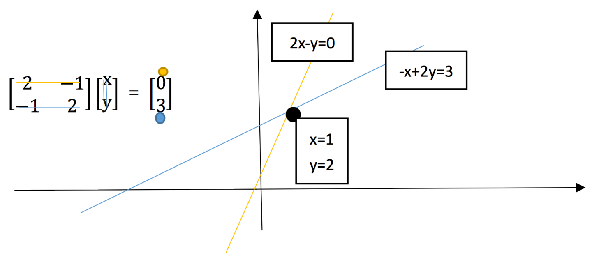
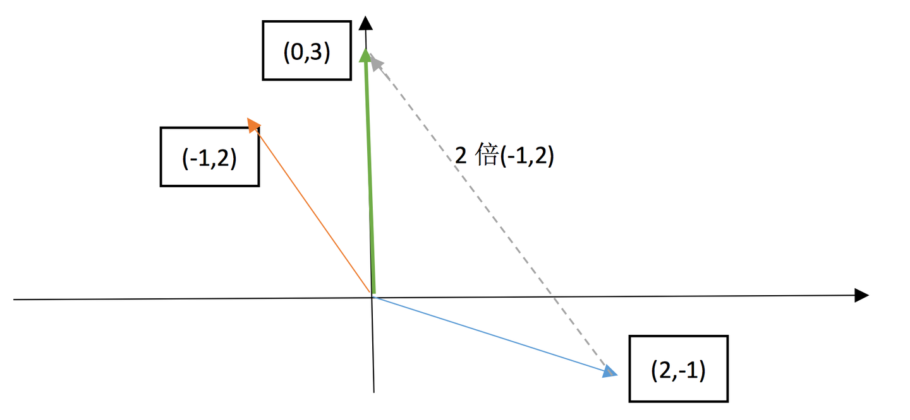
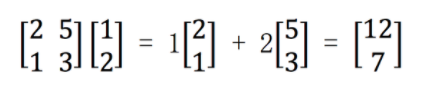
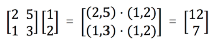

# 线性代数笔记(补充)

## 方程组

* 方程组的几何解释：

  > https://zhuanlan.zhihu.com/p/28277072

  * 行图像：

    * 二维行图像：两条直线交于一点
    * 
    * 高维行图像：高维平面相交

  * 列图像：

    * 二维列图像：两个向量的线性组合
    * 
    * 高维列图像：多维向量的线性组合

  * 矩阵乘法：

    * 列向量的组合：

      

    * 行向量的组合：

      

---

---

## 施密特正交化

* 几何意义：https://www.zhihu.com/question/60689540