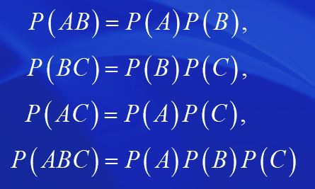

## 第一章 随机事件与概率

### 随机事件

* 统计规律性：在个别试验中呈现不确定的结果，而在大量重复试验中结果呈现某种规律性的现象

* 随机试验：可重复进行；有多重可能性，可能结果明确；结果无法误判

* **样本空间：**

  * 样本点：一个可能的结果
  * 样本空间：全体样本点的集合，$\Omega$

* 随机事件：

  * 事件：试验的结果
  * 随机事件：不一定发生，具有某种规律性的事件；**样本空间的一个子集**
  * 事件发生：集合的一个样本点在试验中出现
  * **基本事件**：不能分解的随机事件；只包含一个样本点的事件
  * 必然事件：每次试验一定发生，如$\Omega$
  * 不可能事件：每次试验一定不发生，如$\empty$  

* 事件之间的关系与运算：

  * 包含：$A$发生必然导致$B$发生，记作$A\subset B$

  * 相等：$A\subset B$且$B\subset A$，记作$A=B$

  * 和(并)：$A$或$B$至少一个发生，记作$A\cup B$

  * 交(积)：$A$与$B$同时发生，记作$A\cap B$

  * 差：$A$发生而$B$不发生，记作$A-B$  

  * 互不相容：$A\cap B=\empty$

  * 两两互不相容事件组

  * 对立事件：$\Omega - A$，记作$\overline{A}$ 

  * 运算法则：

    

---

### 等可能概型

* 概率：随机事件发生的可能性大小，$P(A)$
* 古典概型:
  * 特点：
    * 样本点总数有限
    * 基本事件可能性相同
  * 古典概率：
    * 样本点总数：$n$
    * 事件$A$的样本点个数：$n_A$
    * 事件$A$的概率：$P(A)=\frac{n_A}{n}$ 
  * $n$个元素任取$k$个，有$C_n^k=\frac{n!}{k!(n-k)!}$中不同取法
  * 计数原理：
    * 一件事情分几个步骤完成，则互相之间用乘法
    * 一件事情有若干种方法来完成，则互相之间用加法
* 几何概型：
  * 几何概率：以等可能性为基础，借助于几何上的度量来合理地规定的概率
  * $P(A)=\frac{m(A)}{m(\Omega)}$

---

### 频率与概率

* 频率的稳定性：
  * 在大量重复试验中随机事件发生的频率具有稳定性
  * 在实际应用中，往往就把频率当作概率来使用
* 概率的公理化定义：
  * 非负性：$P(A)\geq 0$
  * 规范性：$P(\Omega)=1$
  * 可列可加性：任意一列两两互不相容事件的和的概率等于所有事件的概率之和
* 概率的性质：
  * 三条公理
  * $P(\empty)=0$
  * 有限可加性
  * $P(\overline{A})=1-P(A)$
  * $A\subset B\Rightarrow,P(B-A)=P(B)-P(A),P(A)\leq P(B)$
  * $P(A)\leq 1$
  * $P(B-A)=P(B)-P(AB)$
  * 加法公式：
    * $P(A\cup B)=P(A)+P(B)-P(AB)$ 
    * $P(A\cup B \cup C)=P(A)+P(B)+P(C)-P(AB)-P(AC)-P(BC)+P(ABC)$  

---

### 条件概率与独立性

* 条件概率：

  * 已知$B$发生的条件下$A$发生的条件概率：$P(A|B)=\frac{P(AB)}{P(B)}$ 
  * 满足三条公理
  * 乘法公式：$P(AB)=P(A)P(B|A),P(AB)=P(B)P(A|B)$

* 事件的相互独立性：

  * $A,B$相互独立：$P(AB)=P(A)P(B)$ 

  * 直观意义：一个事件的发生不影响另一个事件发生的概率，$P(B|A)=P(B),P(A|B)=P(A)$ 

  * $A,B,C$相互独立：

    

* 贝努利概型与二项概率：
  * 贝努利试验：在一个试验中，只关心某个事件发生与否
  * $n$重贝努利试验：把贝努利试验重复独立地做$n$次
    * $A$恰好发生$k$次的概率：$P_n(k)=C_n^k p^k(1-p)^{n-k},k=0,1,\cdots ,n$
    * $\sum_{k=0}^n P_n(k)=[p+(1-p)]^n = 1$，$P_n(k)$为二项概率

---

### 全概公式与逆概公式

* 划分(完备事件组)：
  * 事件组两两不相容
  * 事件组的和为样本空间
* 全概公式：事件$A_1,A_2,\cdots,A_n$构成一个完备事件组，且都有正概率
  * $P(B)=\sum_{i=1}^n P(A_i)P(B|A_i)$
* 逆概公式：$A_i$构成一个完备事件组，且都有正概率
  * $P(A_j|B)=\frac{P(A_j)P(B|A_j)}{ \sum_{i=1}^n P(A_i)P(B|A_i) },j=1,2,\cdots,n$

---

## 第二章 离散型随机变量及其分布

### 一维离散型随机变量

* 一维随机变量：随机试验的样本空间$\Omega$每个样本点$\omega$都有一个实数$X(\omega)$与之对应，把单值实值函数$X=X(\omega)$称为一维随机变量
  * $A=\{ \omega | X(\omega)\in S \}$
  * $\{ X\in S \}$表示事件$A$，$P(X\in S)$表示$P(A)$ 
  * 分布：描述随机变量取值的统计规律性的各种表示形式
* 离散型随机变量：随机变量只可能取有限个值或可列多个值
  * 概率函数：离散型随机变量的分布形式
  * 随机变量$X$的概率函数(概率分布律)：
    * $\Omega_X=\{ a_1,a_2,\cdots ,a_n,\cdots \}$
    * $P(X=a_i)=p_i$
      * $p_i\geq 0$
      * $\sum_{i=1}^\infin p_i=1$
* 常见离散型分布：
  * 0-1分布：$X\sim B(1,p)$
    * $P(X=0)=1-p,P(X=1)=p$
    * 样本空间只含有两个样本点的试验或贝努利试验可用该分布刻画
  * 二项分布：$X\sim B(n,p)$
    * $P(X=k)=C_n^k p^k(1-p)^{n-k},k=0,1,2,\cdots,n$
    * $n$次重复独立试验中，事件$A$发生的次数服从二项分布
  * 超几何分布：$N$个同类产品，$M$件次品，任取$n$个产品$(n\leq N-M)，$其中所含的次品数为$X$
    * $P(X=k)=\frac{C_M^k C_{N-M}^{n-k}}{C_N^n},k=0,1,2,\cdots,min\{M,n\}$
    * $p=\frac{M}{N},lim_{N\rightarrow \infin}\frac{C_M^k C_{N-M}^{n-k}}{C_N^n}=C_n^k p^k(1-p)^{n-k}$ 
    * 只要$N>10n$ ，就用二项分布来近似；当产品总数很大时，有放回抽样和无放回抽样可近似看作相同
  * 泊松分布：$X\sim P(\lambda)$
    * $P(X=k)=\frac{\lambda^k}{k!}e^{-\lambda},\lambda>0$
    * 泊松定理：
      * $\lambda=np_n,lim_{n\rightarrow x}C_n^k p_n^k(1-p_n)^{n-k}=\frac{\lambda^k}{k!}e^{-\lambda}$
      * $n\geq10,p\leq0.1$时二项分布可用泊松分布来近似
  * 几何分布：
    * $P(X=k)=(1-p)^{k-1}p,k=1,2,\cdots$
  * 均匀分布：
    * $P(X=a_i)=\frac{1}{n}$ 
    * 古典概型可用均匀分布来描述 

---

### 二维离散型随机变量

* 二维随机变量：随机试验的样本空间$\Omega$每个样本点$\omega$都有一个对有序实数$(X,Y)$与之对应，称向量$(X,Y)$是二维随机变量
* 联合概率函数：
  * $(X,Y)$的值域为$\Omega_{(X,Y)}=\{ (a_i,b_j);i=1,2,\cdots;j=1,2,\cdots \}$
    * $P(X=a_i,Y=b_j)=p_{ij}$为二维随机变量$(X,Y)$的联合概率函数或联合分布律
* 边缘概率函数：
  * 对于随机向量$(X,Y)$，分量X或Y本身是一个（一维）随机变量，它的概率分布称为$(X,Y)$的关于X或Y 的边缘概率函数或边缘分布律
  * $X$的边缘概率函数：$P(X=a_i)=\sum_j p_{ij}\hat{=}p_{i\cdot}$  
  * $Y$的边缘概率函数：$P(Y=b_j)=\sum_i p_{ij}\hat{=}p_{\cdot j}$   
  * 联合分布可以决定边缘分布，反之不然
* 随机变量的相互独立性：$P_{ij}=p_{i\cdot}\times p_{\cdot j}$对所有的$i,j$都成立，则随机变量$X$与$Y$是相互独立的
  * 如果随机变量$X$与$Y$相互独立，则边缘分布可以决定联合分布
  * 可推广到$n$个随机变量，任意$k$个也相互独立$(2\leq k \leq n-1)$ 
* 条件概率函数：
  * 对任意一个固定的$j,P(Y=b_{j})>0$，称$P(X=a_i|Y=b_j)=\frac{p_{ij}}{p_{\cdot j}}$为已知$\{ Y=b_j \}$发生的条件下$X$的条件概率函数或条件分布律，记作$X|Y=b_j$ 

---

### 随机变量函数的分布

* 一维随机变量函数的分布：已知$X$的分布，求$Y=g(X)$的分布
* 二维随机变量函数的分布：已知$(X,Y)$的分布，求$Z=g(X,Y)$的分布
* 定理：
  * $X_1,X_2,\cdots,X_n$是独立同分布的随机变量，$X_i\sim B(1,p),Y=\sum_{i=1}^{n}X$，则$Y\sim B(n,p)$ 
  * 分布的可加性：
    * $X\sim B(m,p),Y\sim B(n,p),\Rightarrow X+Y\sim B(m+n,p)$
    * $X\sim P(\lambda_1),Y\sim P(\lambda_2)\Rightarrow X+Y\sim P(\lambda_1+\lambda_2)$
  * $X_1,X_2,\cdots,X_n$相互独立$\Rightarrow$ $g(X_1,X_2,\cdots,X_m)$与$h(X_{m+1},\cdots ,X_n)$相互独立$(1\leq m \leq n-1)$

---

## 第三章 连续型随机变量及其分布

### 一维连续型随机变量

* 连续型随机变量：随机变量的值域是一个区间或若干个区间的并
* 分布函数：随机变量$X$的分布函数为定义域为$(-\infin,+\infin)$上的实值函数$F(x)=P(X\leq x)$ 
  * $\forall -\infin < a < b < +\infin, P(a<X\leq b)=F(b)-F(a)$ 
  * 性质：
    * $0\leq F(x)\leq 1$
    * 分布函数单调不减
    * 分布函数右连续
    * $lim _{x\rightarrow -\infin}=0,lim _{x\rightarrow +\infin}=1$ 
* 概率密度函数：定义域为$(-\infin,+\infin)$的非负实值函数$f(x)$，使分布函数可以表示为$F(x)=\int_{-\infin}^{+\infin}f(t)dt$ 
  * $f(x)\geq 0,-\infin < x< +\infin$
  * $\int_{-\infin}^{+\infin}f(x)dx=1$ 
* 常见连续型随机变量：
  * 均匀分布：区间$(a,b)$上的均匀分布，$X\sim R(a,b)$
    * $f(x)=\left\{\begin{array}{lc}c & a<x<b \\ 0 & \text { 其余. }\end{array}\right.$
    * $c=\frac{1}{b-a}$
    * 分布函数：$F(x)=\left\{\begin{array}{lc} 0 & x<a, \\ \frac{x-a}{b-a} & a\leq x < b, \\ 1 & x \geq b   \end{array}\right.$
  * 指数分布：$X\sim E(\lambda),(\lambda >0)$
    * $f(x)=\left\{\begin{array}{lc} \lambda e^{-\lambda x} & x>0, \\ 0 & \text{其余} \end{array}\right.$
    * $F(x)=\left\{\begin{array}{lc} 1-e^{-\lambda x} & x \geq 0, \\ 0 & x<0 \end{array}\right.$
  * 正态分布：$X\sim N(\mu,\sigma^2)$，正态随机变量
    * $f(x)=\frac{1}{\sqrt{2 \pi} \sigma} \mathrm{e}^{-\frac{(x-\mu)^{2}}{2 \sigma^{2}}}, \quad-\infty<x<+\infty$
    * 性质：
      * $f(x)$关于$x=\mu$对称
      * $f(x)$在$x=\mu$处取得最大值$\frac{1}{\sqrt{2\pi}\sigma}$
      * $|x|\rightarrow \infin,f(x)\rightarrow 0$
      * $\sigma^2$较大时，曲线比较平坦，$\sigma^2$较小时，曲线比较陡峭
    * 标准正态分布：$\mu=0,\sigma^2=1$
      * 概率密度函数：$\varphi(x)=\frac{1}{\sqrt{2\pi}}\cdot e^{-\frac{x^2}{2}}$
      * 分布函数：$\Phi(x)=\int_{-\infin}^{+\infin}\varphi(t)dt,-\infin<x<+\infin$
      * $x<0$时，$\Phi(x)=1-\Phi(-x)$
      * $\Phi(0)=\frac{1}{2}$
      * $c>0,\\P(|X|<c)=\Phi(c)-\Phi(-c)=2 \Phi(c)-1,\\P(|X|>c)=1-P(|X| \leq c)=2-2 \Phi(c)$
      * $X\sim N(\mu,\sigma^2),P(a<X \leq b)=\Phi\left(\frac{b-\mu}{\sigma}\right)-\Phi\left(\frac{a-\mu}{\sigma}\right)$
      * $p$-分位数$u_p$：$0<p<1,\Phi\left(u_{p}\right)=\int_{-\infty}^{u_{p}} \varphi(x) \mathrm{d} x=P\left(X \leq u_{p}\right)=p$ 
        * $p\geq \frac{1}{2},u_p\geq 0$
        * $p<\frac{1}{2},u_p=-u_{1-p}<0$ 

---

### 二维连续型随机变量

* 联合分布函数：$F(x,y)=P(X\leq x,Y\leq y),-\infin < x,y < +\infin$

  * 性质：

    

    

* 联合概率密度函数：$f(x,y),F(x, y)=\int_{-\infty}^{x} \int_{-\infty}^{y} f(u, v) \mathrm{d} u \mathrm{~d} v,-\infty<x, y<+\infty$

  * $f(x, y) \geq 0,-\infty<x, y<+\infty$
  * $\int_{-\infty}^{+\infty} \int_{-\infty}^{+\infty} f(x, y) \mathrm{d} x \mathrm{~d} y=1$

* 连续型随机向量的性质：

  

* 常见的分布：

  * 均匀分布：

    

  * 二维正态分布：$(X,Y)\sim N(\mu_1,\mu_2,\sigma^2,\sigma^2,\rho),-\infin < \mu_1,\mu_2 < +\infin,\sigma_1,\sigma_2>0,|\rho|<1$ 

    

* 边缘概率密度函数：
  * 边缘分布函数：$F_X=F(x,+\infin)=P(X\leq x,Y<+\infin)=P(X\leq x)$ 
  * 边缘密度函数：$f_X(x)=\int_{-\infin}^{+\infin}f(x,y)dy,-\infin<x<+\infin$ 
  * 二维正态分布的边缘分布均正态分布：
    * $(X,Y)\sim N(\mu_1,\mu_2,\sigma^2,\sigma^2,\rho)\Rightarrow X\sim N(\mu_1,\sigma^2),Y\sim N(\mu_2,\sigma^2)$ 
* 随机变量的相互独立性：
  * 随机变量$X$与$Y$相互独立：$F(x,y)=F_X(x)F_Y(y)$
  * 离散：$p_{ij}=p_{i\cdot}p_{\cdot j}$
  * 连续：$f(x,y)=f_X(x)f_Y(y)$
* 条件概率密度函数：
  * 条件概率密度函数：$f_{X|Y}(x|y)=\frac{f(x,y)}{f_Y(y)},-\infin <x<+\infin$
  * 条件分布函数：$F_{X|Y}(x|y)=\int_{-\infin}^{x}f_{X|Y}(u|y)du=\int_{-\infin}^x \frac{f(u,y)}{f_Y(y)}du,-\infin < x<+\infin$ 
* 随机变量函数的分布：
  * 一维：
    * $X\sim N(\mu,\sigma^2)\Rightarrow Y=kX+c\sim N(k\mu+c,k^2\sigma^2)$，特别地$\frac{X-\mu}{\sigma}\sim N(0,1)$
  * 二维：已知$(X,Y)$分布，求$Z=X+Y$的分布：
  	* $F_Z(z)=P(X+Y\leq z)=\iint_{x+y\leq z}f(x,y)dxdy$	 
    * 卷积公式：
    	* $f_Z(z)=\int_{-\infin}^{+\infin}f(x,z-x)dx$
    	* $X,Y$相互独立时：$f_Z(z)=\int_{-\infin}^{+\infin}f_X(x)f_Y(z-x)dx$ 
  * 正态分布的可加性：$X\sim N(\mu_1,\sigma_1^2),Y\sim N(\mu_2,\sigma_2^2),X+Y\sim N(\mu_1+\mu_2,\sigma_1^2+\sigma_2^2)$   
    * $kX+lY+b\sim N(k\mu_1+l\mu_2+b,k^2\sigma_1^2+l^2\sigma_2^2)$ 
    * $n$个：
  * $U=max(X_1,\cdots,X_n),V=min(X_1,\cdots,X_n)$：
    * 
    * 

---

## 第四章 随机变量的数字特征

### 数学期望

* 期望定义：
  * 离散型：$P(X=a_i)=p_i,E(X)=\sum_i a_ip_i$
  * 连续型：$E(X)=\int_{-\infin}^{+\infin}xf(x)dx$ 
  * 要求级数或积分绝对收敛
  * 表示随机变量取值的平均值
* 常用分布的期望：
  * 离散型：
    * 0-1分布$B(1,p)$：$E(X)=p$
    * 二项分布$B(n,p)$：$E(X)=np$
    * 泊松分布$P(\lambda)$：$E(X)=\lambda$ 
  * 连续型：
    * 均匀分布$R(a,b)$：$E(X)=\frac{a+b}{2}$
    * 指数分布$E(\lambda)$：$E(X)=\frac{1}{\lambda}$
    * 正态分布$N(\mu,\sigma^2)$：$E(X)=\mu$ 
* 随机变量函数的数学期望：
  * 一维：$Y=g(X)$
    * 离散型：$E(Y)=\sum_i g(a_i)p_i$
    * 连续型：$E(Y)=\int_{-\infin}^{+\infin}g(x)f(x)dx$ 
  * 二维：$Z=g(X,Y)$
    * 离散型：$E(Z)=\sum_{i,j} g(a_i,b_j)p_{ij}$ 
    * 连续型：$E(Z)=\int_{-\infin}^{+\infin}\int_{-\infin}^{+\infin}g(x,y)f(x,y)dxdy$ 
* 期望的性质：
  * 退化分布：常数$c,P(X=c)=1$
  * $E(c)=c$
  * $E(kX+c)=kE(X)+c$
  * $E(kX+lY)=kE(X)+lE(Y)$
  * $X,Y$相互独立时，$E(XY)=E(X)E(Y)$ 

---

### 方差

* 定义：$D(X)=E\{[X-E(X)]^2\}$ 
  * $\sqrt{D(X)}$为标准差
  * $D(X)=E(X^2)-E^2(X)$
* 常用分布的方差：
  * 离散型：
    * 0-1分布$B(1,p)$：$D(X)=p(1-p)$
    * 二项分布$B(n,p)$：$D(X)=np(1-p)$
    * 泊松分布$P(\lambda)$：$D(X)=\lambda$
  * 连续型：
    * 均匀分布$R(a,b)$：$D(X)=\frac{(b-a)^2}{12}$
    * 指数分布$E(\lambda)$：$D(X)=\frac{1}{\lambda^2}$
    * 正态分布$N(\mu,\sigma^2)$：$D(X)=\sigma^2$  
* 方差的性质：
  * $D(c)=0;D(X)=0\Rightarrow P(X=c)=1,c=E(X)$
  * $D(kX+c)=k^2D(X)$
  * $D(X±Y)=D(X)+D(Y)±2E\{(X-E(X))(Y-E(y)) \}$
  * $X$与$Y$相互独立时，$D(X±Y)=D(X)+D(Y)$ 

---

### 协方差与相关系数

* 定义：$cov(X,Y)=E\{ [X-E(X)][Y-E(Y)] \}=E(XY)-E(X)E(Y)$

  * $D(X±Y)=D(X)+D(Y)±2cov(X,Y)$ 
  * $D(aX±bY)=a^2D(X)+b^2D(Y)±2ab\ cov(X,Y)$
  * $X,Y$相互独立时，$cov(X,Y)=0$ 

* 性质：

  

* 相关系数：$D(X)>0,D(Y)>0$

  * $\rho (X,Y)=E[ \frac{X-E(X)}{\sqrt{D(X)}}\cdot\frac{Y-E(Y)}{\sqrt{D(Y)}} ]$
  * $\rho (X,Y)=\frac{cov(X,Y)}{\sqrt{D(X)}\sqrt{D(Y)}}=E(X^*Y^*)$ 
  *  $D(X±Y)=D(X)+D(Y)±2\rho(X,Y)\sqrt{D(X)D(Y)}$ 
  * 若$Y=aX+b$，则它们的相关系数$\rho=\frac{a}{|a|}$ 
  * 性质：

* 相关：

  * 成线性关系：$\rho=±1$
  * 正线性相关：$\rho=1$
  * 负线性相关：$\rho=-1$ 
  * 不相关：$\rho=0$ 
    * $cov(X,Y)=0$或$E(XY)=E(X)E(Y)$或$D(X±Y)=D(X)+D(Y)$ 
    * 相互独立则必定不相关，反之不然
    * 相关一定不独立
    * 二维正态分布中相互独立等价于不相关

---

### 其它数字特征

* 矩：

  * $k$阶原点矩：$E(X^k)$
  * $k$阶中心矩：$E[(X-E(X))^k]$ 
  * 期望为一阶原点矩，方差为二阶中心矩

* 协方差矩阵：

  

  

* 分位数：

  

* 不等式：
  * 切比雪夫不等式：对随机变量偏离期望值的概率做出估计；抽样值大多会集中在平均值附近；根据总体均值和方差，估算一定条件下的概率
  
    
  
  * 柯西—许瓦兹不等式：

---

## 第五章 随机变量序列的极限

* 依概率收敛：

  * 
  * 

* 大数定理：https://zhuanlan.zhihu.com/p/259280292

  * 研究随机变量序列的均值是否会依概率收敛于其期望

  * 不同大数定理：条件不同

  * 马尔可夫大数定理

  * 切比雪夫大数定理：随机变量独立，且方差有共同上界，则服从大数定理

  * 独立同分布大数定理：随机变量独立同分布且方差有界，则服从大数定理

  * 弱大数定理(辛钦大数定理)：随机变量独立同分布，则服从大数定理

    

  * 伯努利大数定律：随机变量独立且都服从0-1分布

    * 大量独立重复实验中，随机事件发生的频率趋近其概率；用频率代替概率

    

* 中心极限定理：

  * 研究随机变量序列的均值服从什么分布

  * 意义：可以用样本来估计总体

  * 独立同分布中心极限定理：随机变量独立同分布，均值服从正态分布

    

    

    

  * 德莫弗-拉普拉斯中心极限定理(二项分布中心极限定理)：随机变量独立且都服从0-1分布

    * n重伯努利试验，当试验次数n足够大时，二项分布近似于正态分布

    
  
    

---

## 第六章 数理统计的基本概念

* 数理统计：主要研究如何以有效的方法收集、整理于分析带有随机性影响的数据，从而对所考察的问题作出推断和预测，为某种决策提供依据和建议。
* 总体与样本：

---

## 第七章 参数估计