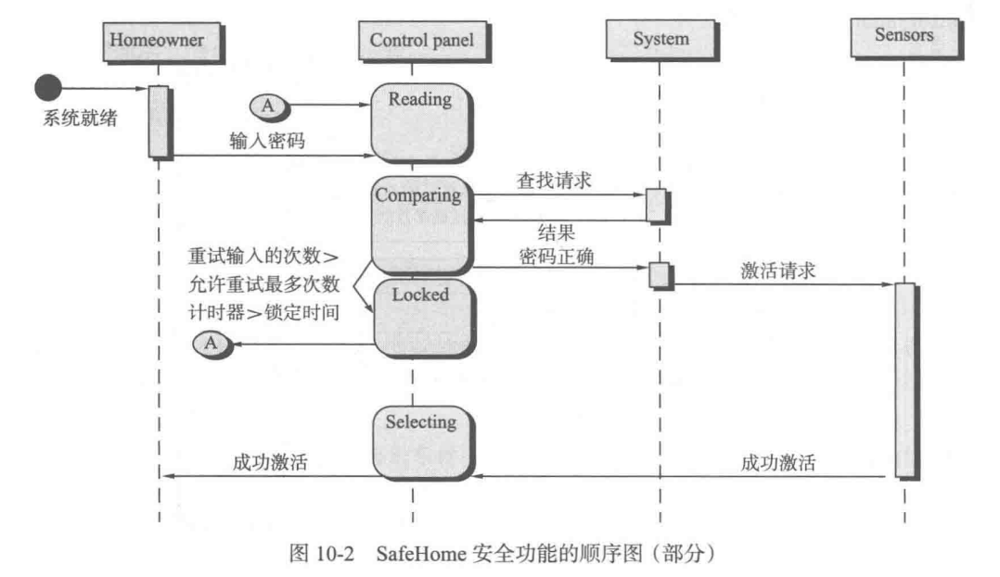

# 软件工程

## 1. 软件的本质

### 1.1 软件的本质(Nature of software)

* 软件定义：
  * (1)**指令**(计算机程序)，在执行时提供所需的特性、功能和性能；
  * (2)**数据结构**：使程序能够充分操作信息；
  * (3)**描述信息**：以硬拷贝和虚拟形式描述程序的操作和使用
  * **instructions** provide desired features, function and performance
  * **data structures** manipulate information
  * **documentation** that describes the operation and use of the programs
* 软件和硬件的不同：
  * 硬件：
    * 磨损
    * “浴缸”曲线
  * 软件：
    * 退化
    * 理想曲线和实际曲线
* 软件分类：
  * System software
  * Application software
  * Engineering/scientific software
  * Embedded software
  * Product-line software
  * Web/Mobile applications
  * Artificial intelligence software

* 遗留软件：
  * **adapted**：computing environments or technology
  * **enhanced**：business requirements
  * **extended**： interoperable with systems or databases
  * **re-architected**：network environment

### 1.2 软件的变更本质(Changing Nature)

* 四大类软件：
  * WebApp
  * 移动App
  * 云计算：
    * 前端
    * 后端
  * 产品线软件
* WebApp性质：
  * 网络密集性
  * 并发性
  * 无法预知的负载量
  * 性能
  * 可用性
  * 数据驱动
  * 内容敏感性
  * 持续更新
  * 即时性
  * 安全性
  * 美观性

---

## 2. 软件工程

* 软件工程定义：
  * (1) 将**系统的、规范的、可量化**的方法应用于软件的**开发、运行和维护**；也就是将工程化方法应用于软件
  * (2) 对于(1)中方法的研究
  * The application of a **systematic, disciplined, quantifiable approach** to the **development, operation, and maintenance** of software; that is, the application of **engineering** to software
  * The study of approaches as in (1)
* 软件工程层次：
  * **工具Tools**：计算机辅助软件工程(**CASE**，computer aided software engineering)
  * **方法Methods**：技术上的解决方法，沟通、需求分析、设计建模、程序构造、测试、软件支持
  * **过程Process**：基础，过程框架
  * 质量关注点A quality focus：根基
* 软件过程：
  * 活动 activities：实现一个大的目标，如communication 
  * 动作 actions：得到一个工作产品，如体系结构图 
  * 任务 tasks：实现一个小而明确目标，如一个单元测试
* 过程框架：
  * **框架活动**(process framework)：
    * 沟通 communication：包含了与客户之间⼤量的**交流和协作**，理解利益相关者的**项目目标**，并**收集需求**以定义软件的特性和功能
    * 策划 planning：：指为后续的软件⼯程⼯作**制定计划**，它描述了需求执⾏的技术**任务**，可能的**⻛险**，**资源需求**，**⼯作产品**和**⼯作进度**
    * 建模 modeling：包括**创建模型**和**设计**两个方面，创建模型有助于客户和开发⼈员更好地**理解软件需求**，设计可以**实现需求**
    * 构建 construction：包括编码和测试
    * 部署 deployment：将软件交付到用户手中，并对其进行评测并给出反馈意见
  * 普适性活动(umbrella activity)：
    * 软件项目跟踪和控制 software project tracking and control
    * 风险管理 risk management
    * 软件质量保证 software quality assurance
    * 技术评审 technical review
    * 测量 measurement
    * 软件配置管理 software configuration management
    * 可复用管理 reusability management
    * 工作产品的准备和生产 work product preparation and production
* 软件工程实践的精髓(必要性)：
  * 理解问题（沟通和分析） understand the problem（communication and analysis）
  * 策划解决方案（建模和软件设计） plan a solution（modeling and software design）
  * 实施计划（代码生成）  carry out the plan（code generation）
  * 检查结果的正确性（测试和质量保证） examine the result for accuracy（testing and quality assurance）
* 软件开发神话(被人盲目相信的说法，谬误)(Software development myths)：
  * 管理神话：
    * 项目经理过分依赖书本、教条
    * 增加人员就能赶上进度
    * 外包给第三方公司，就不用管了
  * 客户神话：
    * 大致了解项目目标，就开始写，之后完善细节
    * 软件很容易适应变更
  * 从业者神话：
    * 完成程序并交付后，完工了
    * 程序开始运行才能查看代码质量
    * 可执行程序是唯一的可交付的工作成果
    * 软件工程将导致我们产生大量文档，因此降低工作效率

---

## 3. 软件过程结构

* 通用过程模型：

  * **框架活动**由**动作**构成；动作由**任务集**来定义；任务集明确了**工作任务、工作产品、质量保证点、项目里程碑**

    * 活动，动作，任务集关系：
      * activity主要实现宽泛的⽬标，与应⽤领域，项⽬⼤⼩，结果复杂性或者实施软件⼯程的重要程度没有直接关系
      * 动作action包含了主要⼯作产品⽣产过程中的⼀系列任务
      * 任务task关注⼩⽽明确的⽬标，能够⽣产实际的产品

  * 普适性活动：框架活动的补充实现，贯穿软件项目始终，全程起作用，帮助团队管理和控制项目进度、质量、变更和风险

  * 过程框架：

    

  * 过程流：

    * 线性过程流 linear
    * 迭代过程流 iterative
    * 演化过程流 evolutionary
    * 并行过程流 parallel

* 框架活动例子：

  * 简单的小项目：

    * activity：沟通活动（communication）
    * action：电话沟通
    * work tasks：
      * 与利益相关者通过电话取得联系
      * 讨论需求，记录笔记
      * 整理笔记，转化为书面形式的需求
      * 将需求发送给利益相关者进行审查和批准

  * 大型项目：

    * activity：communication
    * actions：
      * 起始 inception
      * 需求获取 elicitation
      * 需求细化 . elaboration
      * 协商 negotiation
      * 规格说明和确认 specification and validation

  * 沟通**活动**中的需求获取**动作**的任务集：

    

    * 找出利益相关者(stakeholder)

* 过程模式：针对问题的可证明的解决方案，一个模板

  * 
  * 

* 过程评估：

  * a. 用于过程改进的CMMI标准评估方法 
  * b. 用于组织内部过程改进的CMM评估 
  * c. SPICE 
  * d. ISO 9001 : 2000 for Software

---

## 4. 过程模型

* 惯用过程模型：
  * 其活动和任务都是按照过程的特点指引顺序进行的
  * 规定了一套过程元素——框架活动、软件工程过程动作、任务、工作产品、质量保证以及每个项目的变更控制机制；还定义了**过程流**

* 瀑布模型(waterfall)：经典生命周期( classic life cycle )

  * 
  * 特点：
    * 最早的经典的模型
    * 一个系统的顺序的软件开发方法
    * 理论上开发中不会中断、反复
    * 所有需求百分之九十以上明确
  * 不足：
    * 开发过程中断，整个项目中断，没有并行开发来弥补
    * 最终才能看到产品，周期长，中途看不到产品

* V模型：

  

  * 测试：
    * 单元测试
    * 集成测试
    * 系统测试
    * 验收测试
  * 提供了一种将验证和确认动作应用于早期软件工程工作的直观方法
  * 开发阶段和测试阶段的依赖相关联

* 增量模型(Incremental)：

  

  * 特点：
    * 第一个增量是核心产品，满足了基本的需求
    * 后续增量是前面增量的完善，每一次增量的发 布都是一个完整可运行的产品
    * 不同的增量之间可能有并行、交叉
    * 每一个增量开发从理论上来说是一个瀑布模型
  * 使用场景：
    * 时间：短期可以使用初期产品
    * 技术：前期增量用一种技术，后期增量用新的技术
    * 资金：前期投入部分资金
    * 需要主要需求比较明确

* 演化过程模型(Evolutionary)：

  * 演化模型是迭代的过程模型

  * 原型开发(Prototyping)：

    

    * 快速开发出一个原型，用于诱导需求，交付利益相关者评估，根据反馈信息进一步精练需求；原型设计不完善，没有实际功能，用完后丢弃；原型完成后可以用瀑布模型和增量模型进行开发

  * 螺旋模型(spiral)：

    

    * 风险驱动
    * 迭代的模型
    * 适合于大型、风险高的项目
    * 迭代存在于整个软件生命周期

* 统一过程：

  * 
  * 用例驱动，以架构为核心，迭代并且增量
  * 从传统的软件过程中挖掘最好的特征和性质，但是以敏捷软件开发中许多最好的原则来实现
  * 建立了迭代的、增量的过程流，提供了演进的特性
  * 过程：
    * 起始阶段：客户沟通和策划活动
    * 细化阶段：沟通和通用过程模型的建模活动
    * 构建阶段：与通用软件过程中的构建活动相同
    * 转换阶段：通用构建活动的后期阶段以及通用部署阶段活动的第一部分
    * 生产阶段：与通用过程的部署活动一致
  * 五个阶段不是顺序进行，而是阶段性地并发进行
  * 工作流分布在所有阶段

## 5. 敏捷开发

* 敏捷软件开发宣言：

  * 个体与交互 胜过 过程与工具
  * 可以工作的软件 胜过 面面俱到的文档
  * 客户协作 胜过 合同谈判
  * 响应变化 胜过 遵循计划
  * 即 自组织团队与客户紧密协作，通过高度迭代式、增量式的软件开发过程响应变化， 并在每次迭代结束时交付经过编码与测试的有价值的软件 胜过 与客户确定合同后在初期制定并遵循基于活动的完整计划，在过程和工具指导下， 通过完成大量文档进行知识传递，最后交付需求

* 采用敏捷原因：

  * 很难预测需求是否会变化
  * 设计和编码同步执行，很难评估需要多少设计
  * 分析、设计、编码和测试不容易预测

* 敏捷：

  * 建立能解决**不可预测性**的过程
  * 过程具有**可适应性**
  * 使用**增量式开发策略**

* 敏捷原则：

  * 

* 极限编程(XP)：

  

  * 策划：客户创建**用户故事**，根据综合业务价值标明权值，评估故事开发成本，若超过三个开发周，则要求客户细分，重新赋予权值并计算成本
    * 项目速度：实现的用户故事个数
  * 设计：使用**CRC卡片**明确和组织类，这是设计工作唯一的产出。对于困难的故事设计，采用spike解决方案，实现并评估设计原型
  * 编码：先不去编码，而是先开发一系列单元测试。采用**结对编程**，两人一起开发同一个故事；结对编程完成后进行集成
  * 测试：单元测试，使用一个可以自动实施的框架；验收测试即客户测试，根据实现的用户故事确定

* scrum：

  * 
  * Scrum 是一个敏捷开发框架，是一个**增量的、迭代**的开发过程。在这个框架中，整个开发周期包括若干个小的迭代周期，每个小的迭代周期称为一个 Sprint，每个 Sprint 的建议长度 2 到 4 周
  * 产出：
    * backlog：管理工作产品或项目的需求，在每个 Sprint 中，Scrum 开发团队从 Backlog 中 挑选 最有价值的需求进行开发
    * sprint backlog：Sprint 中挑选的需求经过 Sprint 计划会议上的分析、讨论和估算得到一 个 Sprint 的 任务列表。在每个迭代结束时， Scrum 团队将交付潜在可交 付的产品增量
    * burn down chart：在项目完成之前，对需要完成的工作的一种可视化表示。在开始的时候， 由于估算上的误差或者遗漏，工作量有可能呈上升态势
  * 角色：
    * product owner
    * scrum master
    * team：
      * 跨职能
      * 自组织
      * 整体对产品负责
  * **开发流程：**
    * i. 开发调研：故事列表
    * ii. 工作量估算：带估算的故事列表
    * iii. 发布计划会议 ：backlog(按照商业价值排序的故事列表)
    * iv. sprint计划会议：Sprint Backlog(挑选出的故事,2~4周)，再细化成小的任务(2天)，团队成员挑选
    * v. sprint潜在可交付的产品增量
      * 过程：每日站会
    * vi. sprint评审会议 
    * vii. sprint回顾会议：更好的 Scrum 流程

---

## 7. 指导实践的原则

* 软件工程的半衰期是3年
* 核心原则 core principles：
  * at the process level：
    * framework and umbrella activities 框架和普适性活动
    * navigate the process flow 过程流程
    * produce software engineering work product 产出软件工程工作产品
  * **at the practice level**(*)
    * analyze a problem 分析
    * design a solution 设计
    * implement the solution 实现
    * test the solution 测试
    * deploy the software 部署
* 指导过程的原则：
  * Be agile：敏捷、灵活
  * Focus on quality at every step：每一步都关注质量
  * Be ready to adapt：做好适应的准备，使用多种解决策略
  * Build an effective team：建立一个有效的团队
    * 考虑：i. 业务 ii. 技术 iii. 人员数量（最高可需要） iv. 人员经验
  * Establish mechanisms for communication and coordination：建立沟通、协调机制
  * Manage change：管理变更
  * Assess risk：评估风险
  * Create work products that provide value for others：创造能给别人代理价值的工作产品
* **指导实践的原则**(*)：**on-time**,**high-quality**,**operational** that contains **functions** and **features** that meet the need of all stakeholders
  * Divide and conquer：分治策略
  * Understand the use of abstraction：理解抽象模型
  * Strive for consistency：力求一致性
  * Focus on the transfer of information：关注消息传递信息流转换
  * Build software that exhibits effective modularity：系统模块化
  * Look for patterns：寻找模式
  * When possible, represent the problem and its solution from a number of different perspectives：多种角度看待问题和解决方案
  * Remember that someone will maintain the software 总有人将要对软件进行维护

### 指导框架活动的原则(*)

* 沟通原则：
  * 倾听
  * 有备而来
  * 要有人主持
  * 面对面沟通
  * 记录和纪要
  * 通力合作
  * 模块化讨论
  * 一幅图胜过千言万语
  * 转换话题
  * 协商不是一场竞赛或者一场游戏，协商双赢时才发挥了协商的最大价值
* **策划原则**(*)：strategic goal and tactical objectives;not overplanning and underplanning;planning should be conducted in moderation;everyone participate in(战略性和战术性目标；策划要适度;所有人都要参与)
  * 理解项目范围
  * 吸引利益相关者参与讨论
  * 计划的制订应按照迭代方式进行
  * 根据已知进行估计
  * 考虑风险
  * 保持脚踏实地
  * 调整计划粒度
  * 制定计划确保质量
  * 描述如何适应变换
  * 经常跟踪并根据需要调整计划
* 建模原则：
  * 
  * 
  * **需求建模原则**(*)：i. 数据建模 ii. 行为建模 iii. 功能建模
    * 必须描述并理解问题的信息域，信息域包括了流入系统的数据，流出系统的数据，数据存储
    * 必须确定软件所要实现的功能
    * 必须描述软件的行为（作为外部事件的结果）
    * 描述信息、功能和行为的模型必须以一种能揭示分层细节的方式分解开来
    * 分析任务应该从本质信息转向实现细节
    * 
  * **设计建模原则**(*)：i. 体系结构设计 ii. 用户界面设计 iii. 组件设计(the design model that is created for software provides a variety of different views of the system；为软件创建的设计模型提供了系统的各种不同视图)
    * 设计可追溯到需求建模
    * 要始终关注待建模系统的架构
    * 数据设计与功能设计同等重要
    * 必须精心设计接口
    * 用户界面设计必须符合最终用户要求
    * 构件级设计应是功能独立的
    * 构件之间以及构件与外部环境之间松散耦合
    * 设计表述（模型）应该做到尽可能易于理解
    * 设计应该迭代式进行
* 构建原则：
  * 编码原则：
    * 准备原则。在写下每行代码前，要确保：
          理解所要解决的问题；
          理解基本的设计原则和概念；
          选择一种能够满足构建软件以及运行环境要求的编程语言；
          选择一种能够提供工具以及简化工作的编程环境；
          构件级编码完成以后进行编码测试
    * 编程原则。在开始编码时，要确保：
          遵循结构化编程方式来约束算法；
          考虑使用结对编程；
          选择能满足设计要求的数据结构；
          理解软件架构并开发出与其相符的接口；
          尽可能保持条件逻辑简单；
          开发的嵌套循环应使其易于测试；
          选择有意义的变量名并符合相关编码标准；
          编写注释，使代码具有自说明性；
          增加代码的可读性
    * 确认原则。在完成第一阶段的编码之后，要确保：
          适当进行代码走查；
          进行单元测试并改正所发现的错误；
          重构代码
  * 测试原则：
    * 所有的测试都应该可以追溯到用户需求；
    * 测试计划应该远在测试之前就开始着手；
    * 将Pareto原则应用于软件测试；
    * 测试应该从“微观”开始，逐步转向“宏观”；
    * 穷举测试是不可能的
* 部署原则：
  * **deployment activity**(*)
    * delivery 交付
    * support 支持
    * feedback 反馈
  * 客户对于软件的期望必须得到管理；
  * 完整的交付包应经过安装和测试；
  * 技术支持必须在软件交付之前就确定下来；
  * 必须为最终用户提供适当的说明材料；
  * 有缺陷的软件应该先改正再交付
* **代码重构**(*)
  * a. 重命名 
  * b. 抽取代码 
  * c. 封装字段 
  * d. 抽取接口 
  * e. 提升方法内的局部变量为方法的参数 
  * f. 删除参数 
  * g. 重排参数
* **工作实践**(*) 
  * a. Interfaces 
  * b. Conventions and templates 
  * c. Layering 
  * d. Algorithmic complexity 
  * e. Hashing 
  * f. Caching 
  * g. Concurrency 
  * h. Cloud computing 
  * i. Security 
  * j. Relational databases

---

## 8. 理解需求

* 需求工程：
  * 是指致力于不断理解需求的**大量任务和技术**
  * 是一个软件工程**动作**
  * 开始于**沟通**并持续到**建模活动**
  * 在**设计**和**构建**之间建立起联系的桥梁
  
* 需求工程七项明确的任务：一些任务会**并行**发生
  * 起始 Inception
  
    * 建立基本的理解
  
  * 获取 Elicitation
  
    * **建立商业目标**
    * 存在困难的问题：
      * 范围问题
      * 理解问题
      * 易变问题
    * 有组织地需求收集
  
  * 细化 Elaboration
  
    * 核心：开发需求模型（书8~10章）
  
    * 解析每个用户场景，提取：分析类
  
      - 定义每个分析类的属性
  
      - 确定每个类所需要的服务（即操作、方法）
  
      - 确定类之间的关联和协作关系。
        - 完成：各种补充图
  
  * 协商 Negotiation
  
    * 对需求排序
    * 评估成本和风险
    * 按优先级讨论处理冲突
  
  * 规格说明 Speciæcation
  
    * 形式不定，文档
  
  * 确认 Validation
  
    * **技术评审**
  
  * 需求管理 Requirement management
  
    * 用于帮助项目组在项目进展中**标识、控制和跟踪需求以及需求变更**的一组活动
  
* **建立根基**(Inception)：

  * 确认利益相关者：直接或间接地从正在开发的系统中获益的人
  * 识别多重观点：把所有利益相关者提供的信息分类
  * 协同合作
  * 首次提问

* **获取需求**(Elicitation)：

  * 协作获取需求

    * 会写一两页“产品要求”

      - 对象列表
        - 小规格说明

      - 服务列表：作用于对象

      - 约束列表

      - 性能标准

  * 质量功能部署(QFD)：将客户要求转化成软件技术需求的技术

    * 常规需求：存在即满意
    * 期望需求：缺少即不满
    * 兴奋需求：超出预期
    * QFD可应用于整个软件工程，但特定的QFD技术可用于需求获取活动
    * 产出：客户意见表

  * 使用场景

    * 创建一系列使用场景（最终用户如何使用）。即为：**用例**

  * 获取工作产品

    * 系统规模不同，需求获取后产生的工作产品也不同
    * 包括：(SRS文档内容)
      * 要求和可行性
      * 产品范围
      * 利益相关者
      * 技术环境
      * **需求列表**(来自QFD)
      * 使用场景(**用例)**
      * 原型

  * 敏捷需求获取：**记事卡片**上的用户故事使开发者更容易选择和管理需求子集

  * 面向服务的方法：将系统看做一套服务的集合

* **开发用例**(Elaboration)：

  

* **构建分析模型**：为基于计算机的系统提供必要的信息、功能和行为域的说明

  * 分析模型的元素(后三章)：
    * **基于场景的元素**：从用户的视角描述系统
      * 用例规约和用例图
      * 活动图
    * **基于类的元素**：交互时操作的对象
      * 类图
    * **行为元素**：描述行为的建模元素
      * 状态图
  * 分析模式：可重用的分析模型
  * 敏捷需求工程：把利益相关者的思想传递给软件团队，将需求工程和设计活动分离开来
  * 自适应系统的需求

* **避免常见错误**：

  * 特性偏好
  * 灵活性偏好
  * 性能偏好

---

## 9. 基于场景的需求建模

> 需求不是架构，需求既不是设计，也不是用户接口，需求就是指需要什么

* 需求模型：

  

  > 需求模型所有元素都可以直接跟踪到设计模型；通常难以清楚地区分这两个重要的建模活动之间的设计和分析工作；
  >
  > 需求(分析)模型作为桥梁连接系统描述和设计模型

  * **场景模型**
    * 从用户的视角描述系统
    * 出自各种系统“参与者”观点的需求
      * 用例
      * 用户故事
  * **面向类的模型**
    * 基于类的建模：定义了对象、属性和关系
    * 通过类的协作获得系统需求
      * 类图
      * CRC
      * 包图
  * **基于行为和模式的模型**
    * 描述了系统状态、类和事件在这些类上的影响
    * 描述了如何将软件行为看作是外部“事件”后续的模型
      * 状态图
      * 顺序图
  * 数据模型
    * 描述问题信息域的模型
  * 面向流/过程的模型
    * 表示系统的功能元素并且描述当功能元素在系统中运行时怎样进行数据变换

* 域分析：

  * 识别、分析和详细说明某个特定应用领域的共同需求

  * 在某个特定应用领域内，根据通用的对象、类、部件和框架，识别、分析和详细说明公共的、可复用的能力

  * 一个**普适性活动**

  * 域分析师的角色是发现和定义**可复用**的**分析模式**、**分析类**和相关信息

  * 输入输出：

    

* 需求建模的方法：

  * 结构化分析：考虑数据和将数据转化为分离实体的过程
  * 面向对象的分析：考虑类和类之间的协作

* 需求模型的元素：

  

* 基于场景建模步骤：

  * a. 创建一个初步的用例：事件流
  * b. 细化初始的用例：异常处理
  * c. 写出正式的用例：用例规约

* 补充用例的UML模型：

  * 活动图：记得画开始、结束记号

    

  * 泳道图：

    

---

## 10. 基于类的需求建模

* 识别分析类：	

  * 语法解析：
    * 带下划线的名词或名词词组可以确定为类
    * 名词输入到表中，标注同义词
    * 分类：
      * 外部实体
      * 事物
      * 事件
      * 角色
      * 组织单元
      * 场地
      * 结构
    * 特征：
      * 保留信息：记录信息
      * 所需服务：一组操作
      * 所需服务
      * 多个属性
      * 公共属性
      * 公共操作
      * 必要需求

* 描述属性：

  * 数据项：

    

* 定义操作：

  * 类型：
    * 以某种方式操作数据
    * 执行计算的操作
    * 请求某个对象的状态的操作
    * 监视某个对象发生某个控制事件的操作
  * 研究语法解析并分离出动词，一部分将是合法操作并连接到某个类

* 类-职责-协作者建模(CRC)

  * 类：
    * 实体类
    * 边界类
    * 控制类
  * 职责
  * 协作：
    * is part of：聚合
    * has knowledge of：从另一个类获取信息
    * depends on：依赖

* 关联和依赖：

  * 关联：
    * 多样性：一对多，多对多
    * 实线箭头
  * 依赖：
    * 客户-服务器关系
    * 虚线箭头

* 分析包：分类打包

---

## 11. 基于行为和模式的需求建模

* 生成行为模型：

  * a. 评估用例，理解交互顺序 
  * b. 识别驱动交互顺序的事件，理解如何与特定的对象相互关联
  * c. 为每个用例生成序列 
  * d. 创建系统状态图 
  * e. 评审行为模型，确保准确性和一致性

* 识别用例事件：

  * 系统和参与者之间交换了信息就发生事件

* 状态表达：

  * 两种状态描述：

    * 系统执行其功能时每个类的状态
    * 系统执行其功能时从外部观察到的系统状态

  * 类状态：

    * 被动状态：所有属性的当前状态
    * 主动状态：对象进行持续变换或处理时的当前状态
      * 事件才能使主动状态转移

  * 两种行为表现形式：

    * 状态图：**一个类**如何改变基于外部事件的状态

      

      * 守卫：转移的布尔条件
      * 动作：与状态转移同时发生

    * 顺序图：以时间函数的形式显示软件的行为，事件从一个对象到另一个对象的转移

      

* 需求建模的模式：发现分析模式

---

## 12. 设计概念

* 软件设计：
  * 包括一系列**原理、概念和实践**，可以指导**高质量**的系统或产品开发
  * 是建模活动的最后一个软件工程活动
* 需求模型和设计模型区别 
  * a. 需求模型关注于描述需求的数据，功能和行为 
  * b. 设计模型提供关于软件体系结构，数据结构，接口和组件的细节

* 从需求模型到设计模型的转换：

  

* 设计模型：

  * 数据/类设计：将类模型转化为设计类的实现以及软件实现所要求的数据结构
    * CRC图中定义的对象和关系，以及类属性
  * 体系结构设计：定义了软件的主要结构化元素之间的关系、体系结构风格和模式、影响体系结构实现方式的约束
    * 从需求模型导出
  * 接口设计：描述了软件和协作系统之间、软件和使用人员之间是如何通信的
    * 使用场景和行为模型
  * 构件级设计：将软件体系结构的结构化元素变换为对软件构建的过程性描述
    * 基于类的模型和行为模型

  > 软件质量是在设计中建立的

* 设计过程：

  * 软件设计是一个**迭代**的过程，将需求变换为用于构建软件的“蓝图”
  * 随着设计迭代的开始，后续的细化导致更低抽象层次的设计表示；这些表示仍能跟踪到需求，但是连接更加错综复杂了

* 软件质量指导原则和属性：

  * 质量指导原则
    * 体系结构
    * 模块化
      * 包含数据、体系结构、接口和构件的清晰表示
    * 导出数据结构
    * 导出独立功能特征的构件
    * 导出接口
    * 设计的导出应采用可重复的方法进行
    * 使用能够有效传达其意义的表示法来表示
  * 质量属性：
    * 功能性
    * 易用性
    * 可靠性
    * 性能
    * 可支持性
      * 可维护性：可扩展性、可适应性、可使用性

* 设计概念：

  * 抽象：
    * 过程抽象：具有明确和有限功能的指令序列，暗示了功能但隐藏具体的细节
      * 如开门，**开**隐含了一长串的过程性步骤
    * 数据抽象：描述数据对象的具名数据集合
      * 在过程抽象**开**的场景下，定义一个`door`的数据抽象，包含一组描述门的属性
  * 体系结构：程序构件的结构或组织、这些构件交互的方式以及这些构件所用数据的结构
    * 作为体系结构设计一部分的一组属性：
      * 结构特性：系统的构件、构件被封装的方式以及构件之间相互作用的方式
      * 外部功能特性：设计体系结构如何满足需求
      * 相关系统族：抽取出相似系统设计中常预订的重复性模式
    * 体系结构设计模型：
      * 结构模型
      * 框架模型
      * 动态模型
      * 过程模型
      * 功能模型
  * 设计模式：描述了解决某个特定设计问题的设计结构
  * 关注点分离：
    * 问题被分解为可以独立解决或优化的若干块，更容易得到处理
    * 在其他设计概念体现：
      * 模块化
      * 方面：一个横切关注点的表示，一个方面即一个模块，该模块能够使该关注点经过它横切的所有其他关注点而得到实施
      * 功能独立：
        * 独立性评估标准：
          * 内聚性：某个模块相关功能的强度
          * 耦合性：模块间的相互依赖性
      * 求精：逐步求精，自顶向下的设计策略，一个细化的过程
  * 信息隐蔽：每个模块对其他所有模块隐蔽自己的设计决策
  * 重构：一种重新组织的技术，可以简化构件的设计而无需改变其功能或行为
  * 面向对象的设计概念
  * 设计类：
    * 分析类的抽象级相对较高
    * 通过提供设计细节对分析类进行求精，促成类的实现
    * 五种设计类：
      * 用户接口类：定义人机交互所必需的所有抽象
      * 业务域类：识别实现某些业务域元素所必需的**属性和服务**
      * 过程类：实现完整的管理业务域类所必需的**低层业务抽象**
      * 持久类：用于表示将在软件执行之外**持续存在的数据存储**
      * 系统类：实现软件**管理和控制**功能，使得系统能够运行，并与外界通信
    * 四个特征：
      * 完整性与充分性
      * 原始性
      * 高内聚性
      * 低耦合性
  * 依赖倒置：
    * 高层模块不应当直接依赖于底层模块，两者都应当依赖于抽象
    * 抽象不应当依赖于细节，细节应当依赖于抽象
  * 测试设计：接缝测试

* 设计模型：

  * 从两个维度观察：

    * 过程维度：设计模型的演化
      * 设计任务作为软件过程的一部分被执行
    * 抽象维度：详细级别
      * 分析模型的每个元素转化为一个等价的设计，然后迭代求精
    * 

  * 数据设计元素

    * 程序构件级：数据结构
    * 应用级：数据库
    * 业务级：数据仓库

  * 体现结构设计元素：

    * 提供了软件的整体视图
    * 三个来源：
      * 软件的应用域信息
      * 特定的需求模型元素，如数据流图或分析类
      * 可获得的体系结构风格和模式
    * 通常描述为一组相互联系的子系统，且常常从需求模型的分析包中派生出来

  * 接口设计元素：

    * 信息如何流入和流出系统，以及被定义为体系结构一部分的构件之间是如何通信的

    * 三个重要元素：

      * 用户界面：软件工程的主要活动
      * 外部接口
      * 内部接口

    * 空心三角虚线：实现

      

  * 构件级设计元素：

    * 完整地描述了每个软件构件的内部细节
    * 为所有局部数据对象定义数据结构，为所有在构件内发生的处理定义算法细节，并定义运行访问所有构件操作的接口

  * 部署级设计元素：

    * 指明软件功能和子系统将如何在支持软件的物理计算环境内进行分布
    * 

---

## 13. 体系结构设计

* 软件体系架构：程序或计算系统的软件体系结构是指系统的一个或多个结构，它包括**软件构件**、**构件的外部可见属性**以及它们之间的**相互关系**

* 体系结构描述：

  * 视图：从不同角度理解体系结构
  * 因为体系结构的描述为后续的协商奠定了基础，特别是在确定系统边界方面，故而它应该是简洁易懂的

* 体系结构决策：

  * 为了开发每个视图，会考虑多种可选方案，并最终就最能满足关注点的特定的体系结构特征做出决策

* 体系结构类型：规定特定的体系结构方法

  * 人工智能
  * 通信
  * 设备
  * 金融
  * 游戏
  * 工业
  * 法律
  * 医疗
  * 军事
  * 操作系统
  * 运输
  * 实用程序

* 体系结构风格：

  * 以数据为中心的体系结构
  * 数据流体系结构
  * 调用和返回体系结构
  * 面向对象体系结构
  * 层次体系结构

* 体系结构考虑要素：

  * 经济性
  * 易见性
  * 隔离性
  * 对称性
  * 应急性

* 体系结构设计：

  > 原型：表示系统行为元素的一种抽象

  * 系统环境的表示：体系结构环境图(ACD)

    * 上级系统：把目标系统作为某些高层处理方案的一部分
    * 下级系统：这些系统被目标系统使用，并为完成目标系统的功能提供必要的数据和处理
    * 同级系统：这些系统在对等的基础上相互作用
    * 参与者：通过产生和消耗必要处理所需的信息，实现与目标系统交互的实体

    

    

  * 定义原型：表示核心抽象的类或模式；通过需求模型的分析类导出

    

  * 把archetype从设计类转化为组件（考虑协作）：

    

  * 加入界面类，控制类，接口类，数据类，存储类，通讯类：

    

    

---

## 14. 构件设计

* 面向对象观点：

  * 协作类集合
  * 

* 设计基于类的构件：

  * 基本设计原则：
    * 开闭原则OCP
      * 
    * 里氏替换原则
    * 依赖倒置原则
    * 接口分离原则

* 构件设计：

  * 识别与问题域对应的设计类

  * 识别与基础设施域对应的设计类

  * 细化不作为复用构件的设计类

    * 类间协作图：

    

    * 确定接口

    * 细化属性

      

    * 操作的处理流：活动图

      

    * 状态图

      

---

* 需求分析目标（客户角度）：
  * “问题”
  * “机会”
  * 定义“问题”/“机会”
  * 分析“问题”，初步Solutions
* 基于场景建模：“先外后内，先业务后管理”
* 数据流图：
  * 确定系统的输入和输出
  * 由外向里画系统的顶层数据流图
  * 自顶向下逐层分解，绘出分层数据流图
* 数据流图：
  * 回顾基本的系统模型，画出顶层数据流图
  * 检查和细化数据流图，画出分层数据流图
  * 确定数据流图是否有转换或事物流特性
  * 通过指定传入和传出流的边界来隔离转换中心
  * 完成第一级分解
  * 完成第二级分解
  * 使用启发式设计改进第一次迭代架构以提高软件质量
* 设计：
  * 细化到13-1
  * 大题主要面向对象